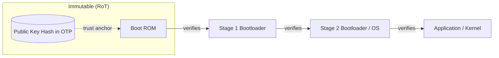

# 00 — Foundations

## Concept

**Secure Boot** ensures a device only executes software that is
authentic (came from the legitimate vendor) and unmodified (integrity),
by verifying each piece of firmware **before** it is executed, starting
from an immutable, trusted piece of code baked into the chip at
manufacturing time (the **Root of Trust**, RoT).

Why it matters:
- Prevents running malicious/tampered firmware (bootkits, implants).
- Protects IP (prevents cloning/unauthorized firmware).
- Required for compliance (PSA Certified, FIPS, automotive ISO 21434, etc.).

### Threat model (what secure boot defends against)
| Threat | Example | Mitigated by |
|---|---|---|
| Firmware tampering | Attacker flashes modified image | Signature verification |
| Firmware substitution | Attacker loads old/insecure image | Anti-rollback (07) |
| Physical extraction of keys | Reading flash/OTP with a probe | Key management, fuses (06) |
| Fault injection / glitching | Voltage/clock glitch to skip a check | Redundant checks (09) |
| Downgrade attack | Re-flash older vulnerable firmware | Security version counters (07) |

### Core terms (glossary preview — full list in `resources/glossary.md`)
- **RoT (Root of Trust)**: The first thing trusted unconditionally — usually
  Boot ROM code + a public key hash burned in OTP/eFuse.
- **Chain of Trust**: Each stage verifies the next before handing over control.
- **Immutable code**: Code that cannot be changed after manufacturing (mask
  ROM or one-time-programmed).
- **OTP/eFuse**: One-Time-Programmable memory used to store keys/hashes/config
  that must not change.

## Diagram — the general idea

Each arrow = "verify signature before jumping to next stage."
If verification fails at any point → **halt / recovery mode**, never execute
unverified code.

## Checklist before moving on
- [ ] Can you explain "Root of Trust" without saying "trust" in the definition?
- [ ] Can you name 3 attacks secure boot protects against?
- [ ] Do you understand why the RoT must be immutable (can't be a
      software-updatable value)?

## Further Reading
See `resources/references.md` (PSA Certified Secure Boot guide, Arm
"Trusted Boot" whitepaper, NIST SP 800-193 Platform Firmware Resiliency).
