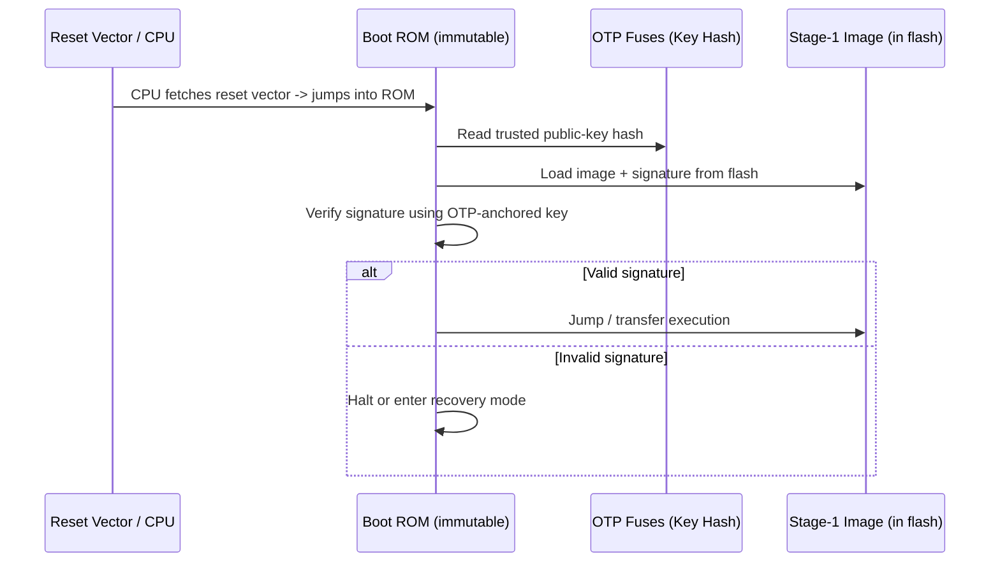

# 01 — Boot ROM

## Concept

The **Boot ROM** (a.k.a. Mask ROM / BootROM / iROM) is the very first code
the CPU executes after reset. It is:
- **Immutable** — burned into silicon at fab time, cannot be patched
  (some SoCs allow ROM-patch mechanisms authenticated separately, but the
  base ROM itself never changes).
- **Minimal** — just enough logic to find, load, and verify the next stage.
- The actual **hardware Root of Trust anchor**, together with a key/hash
  stored in OTP fuses.

### What the Boot ROM typically does
1. Basic clock/memory controller bring-up (only what's needed to read the
   next image — e.g., enable SPI flash / eMMC / internal flash controller).
2. Locate the next-stage image (fixed offset, or via a boot-mode pin/fuse
   selecting SPI/NAND/UART/USB recovery).
3. Read image + its signature/certificate.
4. Verify signature using a public key whose **hash** is stored in OTP
   (the ROM never trusts a key baked into the image alone — see 02).
5. If valid → jump to next stage. If invalid → halt, or enter a fixed
   recovery/download mode (never execute unverified code).

### MCU vs SoC Boot ROM differences
| | MCU (Cortex-M) | SoC (Cortex-A) |
|---|---|---|
| Complexity | Very small (few KB) | Larger (tens of KB), handles multiple boot media |
| Boot targets | Usually just internal flash | SPI NOR, eMMC, NAND, UART/USB fallback |
| Security features | Simple RSA/ECDSA check, single stage | BL1 (ROM) → BL2 (verified), TrustZone setup |
| Recovery | Reset / DFU pin | Dedicated recovery/download mode (USB/UART loader) |

## Diagram



## Pseudo-code — minimal Boot ROM verify-and-jump

```c
/* Runs from mask ROM, cannot be modified in the field */
void boot_rom_entry(void) {
    hw_minimal_clock_init();
    hw_minimal_flash_controller_init();

    image_t *img = flash_map_stage1_image();       /* fixed offset */
    uint8_t pubkey_hash_otp[32];
    otp_read(OTP_PUBKEY_HASH, pubkey_hash_otp, 32);

    if (!verify_pubkey_matches_hash(img->pubkey, pubkey_hash_otp)) {
        enter_recovery_mode();                      /* key not trusted */
    }

    if (!signature_verify(img->pubkey, img->data, img->len, img->signature)) {
        enter_recovery_mode();                       /* tampered image */
    }

    /* Only now is it safe to execute the next stage */
    jump_to((uintptr_t)img->entry_point);
}
```

## Checklist
- [ ] Why must the Boot ROM be immutable rather than field-updatable?
- [ ] Why does the ROM verify the *hash* of the public key (from OTP)
      instead of trusting a public key embedded in the image itself?
- [ ] What should happen when verification fails — and why is "keep
      booting anyway" never acceptable?

## Further Reading
`resources/references.md` → Arm "Boot ROM Requirements", vendor Boot ROM
docs (STM32 RSS/HSE Boot Manager, i.MX HAB, Qualcomm Secure Boot Guide).
