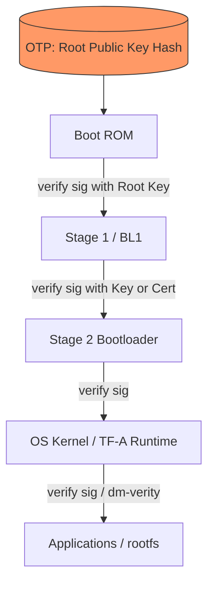

# 02 — Chain of Trust

## Concept

A **Chain of Trust (CoT)** is the sequence of verification steps where each
stage cryptographically verifies the next stage *before* transferring
execution to it. Trust is never assumed — it is transitively established
from the hardware Root of Trust (RoT) forward.

**Golden rule:** *Never execute code that hasn't been verified by something
you already trust.*

### The chain, generically
```
RoT (OTP key hash, immutable)
  -> verifies -> Stage 1 (e.g. MCU: only stage; SoC: BL1/BL2)
       -> verifies -> Stage 2 (bootloader, e.g. U-Boot / BL33)
            -> verifies -> Stage 3 (OS kernel / TF-A runtime)
                 -> verifies -> Application / rootfs
```

Each link needs:
1. **Integrity** — hash of the next image matches what was signed.
2. **Authenticity** — signature was produced by a trusted private key.
3. **Freshness** (optional but recommended) — anti-rollback check (07).

### Certificate-based chains (common in SoCs)
Instead of the ROM trusting many different keys, SoCs often use an
**X.509-like certificate chain**:
```
OTP root-key-hash --verifies--> Root Cert (self-signed)
                                     --signs--> Intermediate Cert (e.g. OEM key)
                                                     --signs--> Image signature
```
This lets OEMs rotate/add signing keys without re-fusing the chip — only the
top-level root key hash must ever be in OTP.

## Diagram



## Pseudo-code — generic chain link verification

```c
typedef struct {
    const uint8_t *pubkey;
    size_t pubkey_len;
    const uint8_t *image;
    size_t image_len;
    const uint8_t *signature;
} signed_image_t;

bool verify_and_boot_next(const trusted_key_t *trusted, signed_image_t *next) {
    /* 1. Authenticity: was 'next' signed by a key we trust? */
    if (!key_is_trusted(trusted, next->pubkey, next->pubkey_len))
        return false;

    /* 2. Integrity: does signature match image bytes? */
    uint8_t digest[32];
    sha256(next->image, next->image_len, digest);
    if (!sig_verify(next->pubkey, digest, next->signature))
        return false;

    /* 3. Freshness (see 07-anti-rollback) */
    if (!version_is_not_rolled_back(next->image))
        return false;

    return true; /* caller may now jump to next->image entry point */
}
```

## Checklist
- [ ] Explain the difference between *integrity* and *authenticity*.
- [ ] Why is a certificate chain more flexible than hardcoding every key
      in OTP?
- [ ] What is the single point of trust that must NEVER be compromised?
      (Hint: the OTP root key hash.)

## Further Reading
`resources/references.md` → PSA Root of Trust spec, Arm PBA (Platform
Security Architecture), X.509 basics.
