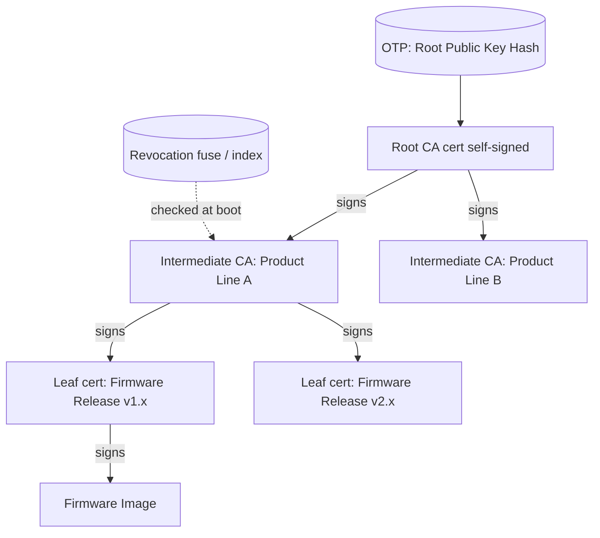
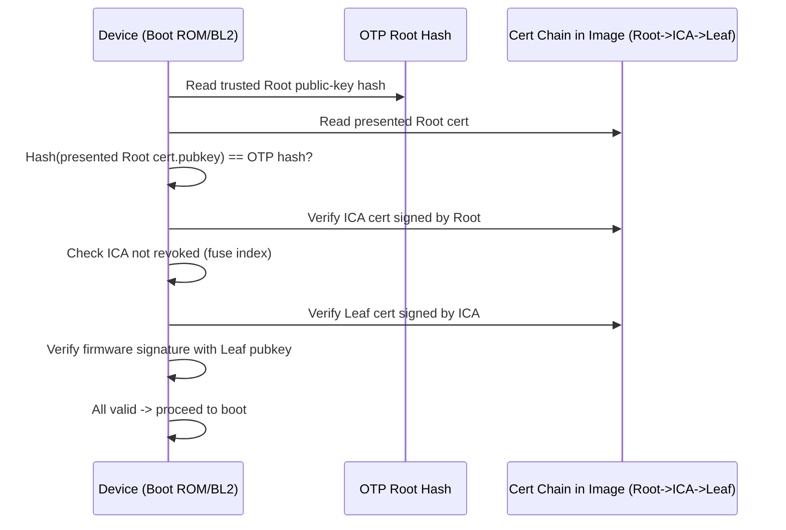

# 03 — Certificate Authority (CA) Hierarchy

## Concept

Folder 02 introduced the idea that a chain of trust can use **certificates**
instead of hardcoding every signing key into OTP. This folder goes deeper
into how a **CA hierarchy** is structured and why it's the standard way
vendors manage many signing keys across products and years.

### Why not just one key forever?
- A single key used for everything is a **single point of catastrophic
  failure** — if it leaks, every device ever shipped is compromised.
- Products change over years; you need to **rotate/retire keys** without
  re-fusing silicon already in the field.
- Different teams/products need **different signing authority** without
  sharing the same private key.

### The CA hierarchy pattern
```
Root CA (offline, HSM, air-gapped, self-signed)
   └── Intermediate CA #1 (e.g., "Product Line A")
   │      └── Leaf / Signing Cert (per firmware release)
   └── Intermediate CA #2 (e.g., "Product Line B")
          └── Leaf / Signing Cert
```
- **Root CA**: highest authority, private key almost never used, kept
  offline. Only its **public key hash** is burned into device OTP.
- **Intermediate CA (ICA)**: signed by the Root, used more frequently
  (e.g., per product line, per year). If compromised, only revoke/replace
  that ICA — Root stays safe, devices keep the same OTP fuse.
- **Leaf certificate / image-signing key**: signs actual firmware images,
  rotated most frequently (e.g., per release or per quarter).

### What a device verifies at boot
A device doesn't need every CA's public key preloaded — it verifies the
**whole chain** at boot time using only the Root hash it already has:
1. Root pubkey hash (OTP) matches the Root cert presented → trust Root.
2. Root cert's signature validates the Intermediate cert → trust ICA.
3. ICA cert's signature validates the Leaf/image signature → trust image.

This mirrors exactly how HTTPS/TLS certificate chains work (see folder
13-ssl-tls-concept) — same X.509-style trust model, applied to firmware
instead of websites.

### Certificate revocation
If an Intermediate or Leaf key is compromised, the chain needs a way to
say "don't trust this cert anymore," even though the Root itself never
changes:
- **Anti-rollback / version counters** for certs (a compromised-and-revoked
  cert has its numeric ID be permanently rejected below a floor value).
- **CRL-like fuse-based revocation**: burn a fuse marking a specific key
  index/ID as revoked, checked at every boot alongside signature checks.

## Diagram





## Pseudo-code

```c
typedef struct { uint8_t pubkey[65]; uint8_t sig[64]; uint32_t id; } cert_t;

bool verify_ca_chain(const uint8_t root_hash_otp[32],
                      const cert_t *root, const cert_t *ica,
                      const cert_t *leaf, const image_t *image) {
    /* 1. Root is self-anchored via OTP hash, not by another signature */
    if (!hash_matches(root->pubkey, sizeof(root->pubkey), root_hash_otp))
        return false;

    /* 2. Root signs ICA */
    if (!cert_signature_valid(root->pubkey, ica))
        return false;
    if (is_revoked(ica->id))
        return false;

    /* 3. ICA signs Leaf */
    if (!cert_signature_valid(ica->pubkey, leaf))
        return false;
    if (is_revoked(leaf->id))
        return false;

    /* 4. Leaf signs the actual firmware image */
    return image_signature_valid(leaf->pubkey, image);
}
```

## Checklist
- [ ] Why keep the Root CA private key offline and rarely used?
- [ ] How does an Intermediate CA reduce blast radius if a key leaks?
- [ ] How can a device revoke a compromised Intermediate/Leaf cert
      without changing the OTP-anchored Root hash?
- [ ] How does this pattern mirror TLS/HTTPS certificate chains
      (see 13-ssl-tls-concept)?

## Further Reading
`resources/references.md` → X.509 PKI basics, CA/Browser Forum baseline
requirements (as a reference model), Global Platform / EMVCo key
management practices for secure elements.
