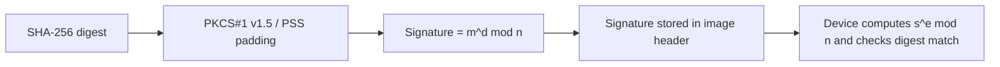
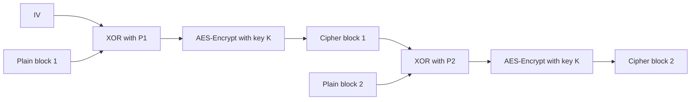
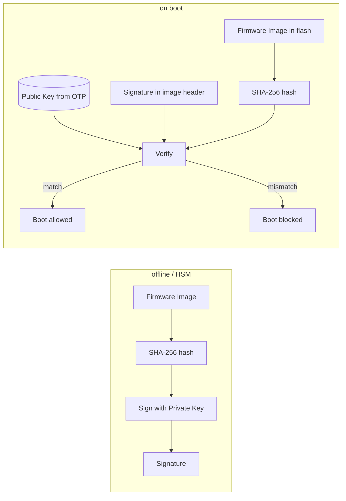
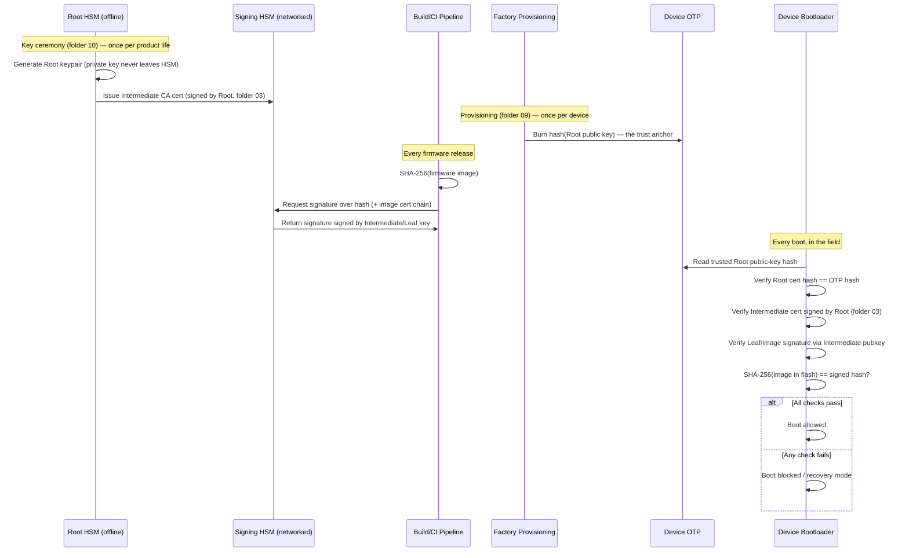

# 04 — Cryptography Basics for Secure Boot

## Concept

Secure boot relies on a handful of crypto primitives. You don't need to be
a cryptographer, but you must understand *what each primitive guarantees*.

### 1. Hashing (integrity)
A cryptographic hash (SHA-256, SHA-384) produces a fixed-size fingerprint
of data. Any change to the data changes the hash completely.
- Used to: fingerprint images, build Merkle-style chains (dm-verity),
  and as the input to digital signatures (you sign the hash, not the
  whole image, for efficiency).

### 2. Asymmetric signing (authenticity) — RSA / ECDSA
- Vendor holds a **private key** (kept offline/HSM), signs firmware.
- Device holds only the **public key** (or its hash) — can verify but
  never forge a signature.
- Common choices: **RSA-2048/3072** (older, larger, needs more RAM),
  **ECDSA P-256/P-384** (smaller keys/signatures, common in newer MCUs).
- See "Algorithm Deep Dive" below for the full math, diagrams, and
  trade-offs of each.

### 3. Symmetric encryption (confidentiality, optional)
- AES-CBC/CTR/GCM to encrypt firmware images so they can't be read even
  if signature isn't the concern (IP protection). Different concern from
  authenticity — encryption != authentication. Use **AES-GCM** (AEAD) when
  you need both.
- See "Algorithm Deep Dive" below for AES-CBC's block-chaining mechanics
  and why it needs a separate MAC for authenticity.

### 4. MAC (lightweight authenticity, resource-constrained MCUs)
- HMAC-SHA256 or AES-CMAC: symmetric-key integrity+authenticity check,
  cheaper than asymmetric verify, but requires a **shared secret** on the
  device (harder to manage than a public key — compromise of device key
  material can be worse).
- See "Algorithm Deep Dive" below for AES-CMAC's construction and why
  it's popular on MCUs without an asymmetric-crypto accelerator.

### Signature verification is NOT optional-cost — do the math
| Operation | Typical cost on Cortex-M0/M3 (no crypto HW accel) |
|---|---|
| SHA-256 over 256KB image | few ms |
| RSA-2048 verify | ~10-50 ms |
| ECDSA P-256 verify | ~20-80 ms (or faster with hw accel) |

This is why many MCUs include a **hardware crypto accelerator** (AES/SHA/
PKA) — verifying on every boot must be fast enough not to hurt UX.

## Big picture — why, when, and which model is implemented

```mermaid
flowchart LR
    subgraph DEV["Development / Release (offline)"]
        BLD[Build firmware]
        HASH[Hash image (SHA-256)]
        SIGN{Need authenticity?}
        CONF{Need confidentiality?}
        MACQ{Symmetric-only device fleet?}
    end

    subgraph FACTORY["Factory provisioning (once per device)"]
        OTP[Provision trust anchor in OTP/eFuse]
        SYM[Optionally provision per-device AES key]
    end

    subgraph FIELD["In-field boot / OTA (every boot)"]
        VERIFY[Verify signature or MAC]
        DEC[Decrypt image if encrypted]
        BOOT[Allow boot only if checks pass]
    end

    BLD --> HASH --> SIGN
    SIGN -->|Yes, public-key model| ASYM[Implement RSA or ECDSA signature]
    SIGN -->|No| MACQ
    MACQ -->|Closed symmetric system| CM[Implement AES-CMAC]
    MACQ -->|Open ecosystem / long-term update| ASYM
    CONF -->|Yes| CBC[Implement AES-CBC/CTR/GCM encryption]
    CONF -->|No| SKIP[Skip encryption]
    ASYM --> OTP --> VERIFY
    CM --> SYM --> VERIFY
    CBC --> DEC
    SKIP --> VERIFY
    VERIFY --> BOOT
    DEC --> BOOT
```

### Why / when / model mapping

| Why implement | When used in lifecycle | Typical model implementation |
|---|---|---|
| Ensure firmware is from trusted vendor (authenticity) | Signing at release, verification at every boot | **ECDSA** (preferred on MCU) or **RSA** (legacy/compatibility) |
| Protect firmware IP from flash readout (confidentiality) | Encrypt before release, decrypt during boot/OTA | **AES-CBC/CTR/GCM** (CBC must be paired with signature/MAC) |
| Lightweight integrity/auth in closed device fleet | Tag generation at release, tag verify at boot | **AES-CMAC** with per-device symmetric keys |
| Keep trust scalable across many devices and key rotation | Across product lifetime (new releases, revocation, renewal) | **Asymmetric model (RSA/ECDSA + certificate chain)** |

**Implementation rule of thumb:** most production secure boot designs use
**ECDSA/RSA for authenticity** and optionally **AES encryption** for IP
protection; **AES-CMAC-only** is mainly for tightly controlled, symmetric
key-managed environments.

## Algorithm Deep Dive — RSA, ECDSA, AES-CBC, AES-CMAC

### RSA (asymmetric signature)
RSA signatures use modular arithmetic over large integers. In secure
boot, vendor signs offline with private exponent `d`; device verifies
with public exponent `e` from OTP/provisioned key material.



- Strengths: mature ecosystem, widely available tooling/certs.
- Trade-off: larger key/signature sizes and more RAM/code than ECC.
- Typical secure-boot profile: RSA-2048 verify on device, signing in HSM.

### ECDSA (asymmetric signature on elliptic curves)
ECDSA signs the hash using an elliptic-curve private key (typically
P-256 for MCU class devices). Verification uses curve point operations.

```mermaid
flowchart LR
    H2[SHA-256 digest] --> K[Generate nonce k]
    K --> R[Compute curve point k*G -> r]
    H2 --> S[Compute s = k^-1(h + r*d) mod n]
    R --> SIG[(r,s) signature]
    S --> SIG
    SIG --> VERIFY[Device verifies with public key Q on curve]
```

- Strengths: much smaller keys/signatures than RSA for similar security.
- Trade-off: needs strong nonce generation; bad nonce reuse leaks private key.
- Typical secure-boot profile: ECDSA P-256 + SHA-256 for constrained devices.

### AES-CBC (symmetric encryption mode)
AES-CBC encrypts firmware for confidentiality (IP protection). Each
ciphertext block depends on the previous block plus IV.



- Strengths: simple, hardware-accelerated on many MCUs.
- Critical limitation: **CBC gives confidentiality only**, not authenticity.
- Secure-boot rule: never use AES-CBC alone for firmware acceptance;
  pair with signature/MAC (or use AEAD like AES-GCM).

### AES-CMAC (symmetric MAC)
AES-CMAC computes an authentication tag from firmware blocks using AES.
It proves integrity/authenticity to anyone with the same secret key.

```mermaid
flowchart LR
    B1[Block 1] --> C1[Chaining state]
    C1 --> A1[AES(K, state)]
    B2[Block 2] --> C2[Next XOR + chain]
    A1 --> C2
    C2 --> A2[AES(K, state)]
    LAST[Last block + subkey K1/K2] --> T[AES(K, final state)]
    A2 --> LAST
    T --> TAG[CMAC tag]
```

- Strengths: lightweight authentication when both ends share a secret.
- Trade-off: symmetric key must exist on device; extracting one key can
  threaten that device's trust model.
- Good fit: closed systems with per-device keys + anti-cloning design.

### Quick selection guide

| Algorithm | Primary purpose | Key management model | Common secure-boot use |
|---|---|---|---|
| RSA | Signature (authenticity) | Public key on device, private key offline/HSM | Legacy/compatibility-heavy platforms |
| ECDSA | Signature (authenticity) | Public key on device, private key offline/HSM | Modern MCU/SoC secure boot |
| AES-CBC | Encryption (confidentiality) | Shared symmetric key | Optional firmware confidentiality |
| AES-CMAC | MAC (integrity/authenticity) | Shared symmetric key | Lightweight integrity in constrained systems |

## Diagram — sign (offline, vendor side) vs verify (on-device)



## End-to-end signature sequence (PKI-aware, full lifecycle)

This ties together folder 03's CA hierarchy, folder 09's provisioning,
and folder 10's HSM operations into a single timeline — from key
generation through field verification:



Key takeaway: **the device never needs to see or fetch anything at boot
time except what's already in flash + the single OTP-anchored Root
hash** — the entire PKI chain (Root → Intermediate → Leaf) travels
alongside the image itself as embedded certificates.

## Pseudo-code — sign/verify pair

```c
/* --- offline, on build server, never on device --- */
void vendor_sign_image(const uint8_t *image, size_t len,
                        const ec_privkey_t *priv, uint8_t sig_out[64]) {
    uint8_t digest[32];
    sha256(image, len, digest);
    ecdsa_sign_p256(priv, digest, sig_out);
}

/* --- on device, every boot --- */
bool device_verify_image(const uint8_t *image, size_t len,
                          const ec_pubkey_t *pub, const uint8_t sig[64]) {
    uint8_t digest[32];
    sha256(image, len, digest);
    return ecdsa_verify_p256(pub, digest, sig); /* true = authentic+intact */
}
```

## Checklist
- [ ] Why do we hash-then-sign instead of signing the whole image directly?
- [ ] Why isn't encryption a substitute for signing (confidentiality vs
      authenticity)?
- [ ] Why is ECDSA often preferred over RSA on constrained MCUs?
- [ ] What's the risk of using a shared-secret MAC instead of asymmetric
      signatures for a fleet of devices?
- [ ] Why is AES-CBC alone unsafe for boot authenticity checks?
- [ ] In what project conditions is AES-CMAC acceptable vs ECDSA/RSA?

## Further Reading
`resources/references.md` → NIST FIPS 186-5 (digital signatures), FIPS
180-4 (SHA), NIST SP 800-38A (CBC mode), NIST SP 800-38B (CMAC),
"Practical Cryptography for Developers" (free online book).
