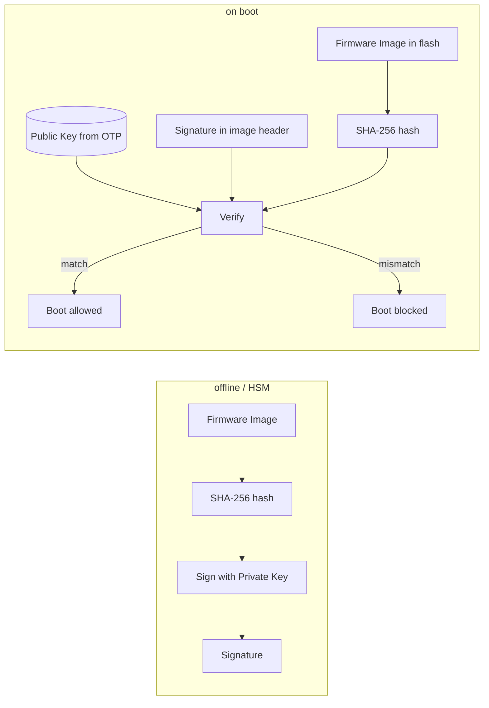
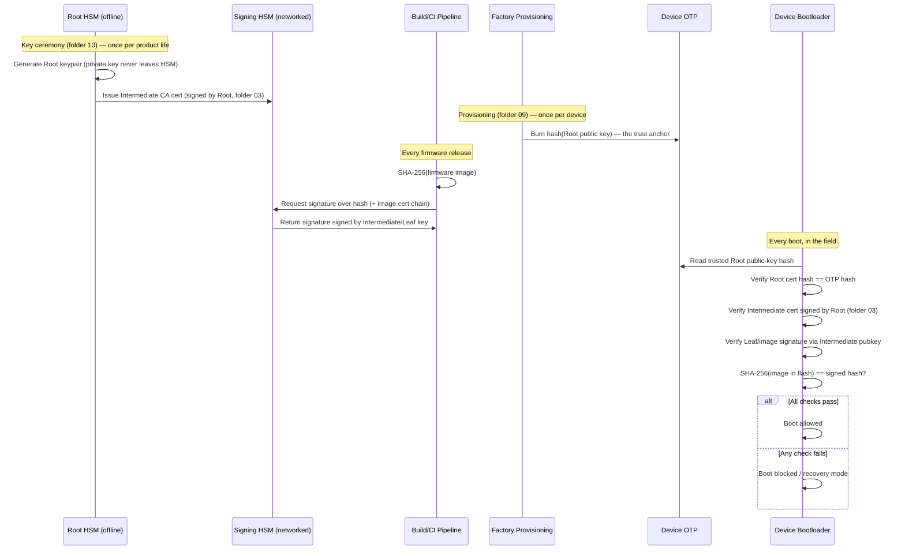

# 04 — Cryptography Basics for Secure Boot

## Concept

Secure boot relies on a handful of crypto primitives. You don't need to be
a cryptographer, but you must understand *what each primitive guarantees*.

### 1. Hashing (integrity)
A cryptographic hash (SHA-256, SHA-384) produces a fixed-size fingerprint
of data. Any change to the data changes the hash completely.
- Used to: fingerprint images, build Merkle-style chains (dm-verity),
  and as the input to digital signatures (you sign the hash, not the
  whole image, for efficiency).

### 2. Asymmetric signing (authenticity) — RSA / ECDSA
- Vendor holds a **private key** (kept offline/HSM), signs firmware.
- Device holds only the **public key** (or its hash) — can verify but
  never forge a signature.
- Common choices: **RSA-2048/3072** (older, larger, needs more RAM),
  **ECDSA P-256/P-384** (smaller keys/signatures, common in newer MCUs).

### 3. Symmetric encryption (confidentiality, optional)
- AES-CBC/CTR/GCM to encrypt firmware images so they can't be read even
  if signature isn't the concern (IP protection). Different concern from
  authenticity — encryption != authentication. Use **AES-GCM** (AEAD) when
  you need both.

### 4. MAC (lightweight authenticity, resource-constrained MCUs)
- HMAC-SHA256 or AES-CMAC: symmetric-key integrity+authenticity check,
  cheaper than asymmetric verify, but requires a **shared secret** on the
  device (harder to manage than a public key — compromise of device key
  material can be worse).

### Signature verification is NOT optional-cost — do the math
| Operation | Typical cost on Cortex-M0/M3 (no crypto HW accel) |
|---|---|
| SHA-256 over 256KB image | few ms |
| RSA-2048 verify | ~10-50 ms |
| ECDSA P-256 verify | ~20-80 ms (or faster with hw accel) |

This is why many MCUs include a **hardware crypto accelerator** (AES/SHA/
PKA) — verifying on every boot must be fast enough not to hurt UX.

## Diagram — sign (offline, vendor side) vs verify (on-device)



## End-to-end signature sequence (PKI-aware, full lifecycle)

This ties together folder 03's CA hierarchy, folder 09's provisioning,
and folder 10's HSM operations into a single timeline — from key
generation through field verification:



Key takeaway: **the device never needs to see or fetch anything at boot
time except what's already in flash + the single OTP-anchored Root
hash** — the entire PKI chain (Root → Intermediate → Leaf) travels
alongside the image itself as embedded certificates.

## Pseudo-code — sign/verify pair

```c
/* --- offline, on build server, never on device --- */
void vendor_sign_image(const uint8_t *image, size_t len,
                        const ec_privkey_t *priv, uint8_t sig_out[64]) {
    uint8_t digest[32];
    sha256(image, len, digest);
    ecdsa_sign_p256(priv, digest, sig_out);
}

/* --- on device, every boot --- */
bool device_verify_image(const uint8_t *image, size_t len,
                          const ec_pubkey_t *pub, const uint8_t sig[64]) {
    uint8_t digest[32];
    sha256(image, len, digest);
    return ecdsa_verify_p256(pub, digest, sig); /* true = authentic+intact */
}
```

## Checklist
- [ ] Why do we hash-then-sign instead of signing the whole image directly?
- [ ] Why isn't encryption a substitute for signing (confidentiality vs
      authenticity)?
- [ ] Why is ECDSA often preferred over RSA on constrained MCUs?
- [ ] What's the risk of using a shared-secret MAC instead of asymmetric
      signatures for a fleet of devices?

## Further Reading
`resources/references.md` → NIST FIPS 186-5 (digital signatures), FIPS
180-4 (SHA), "Practical Cryptography for Developers" (free online book).
