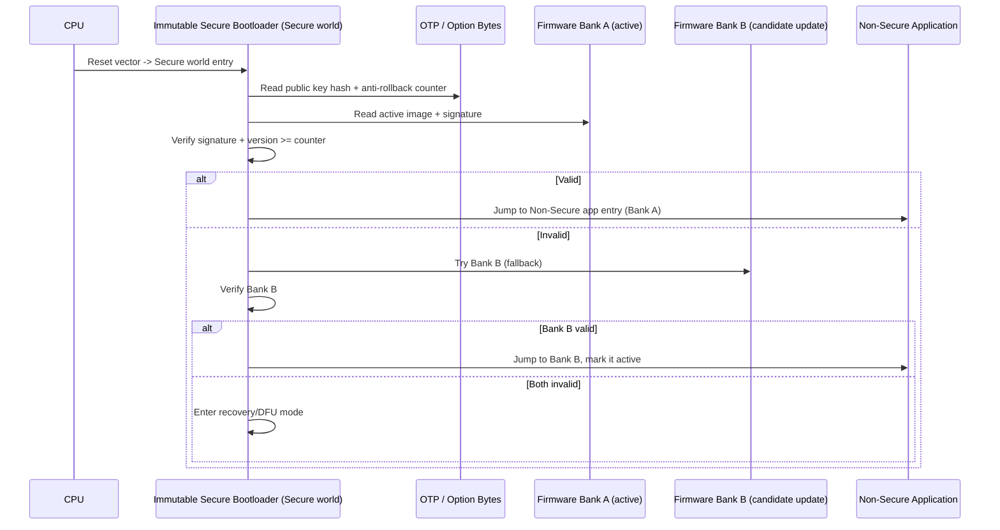

# 03 — MCU Secure Boot (Arm Cortex-M)

## Concept

On a simple **MCU** (e.g., Cortex-M0/M3/M4/M33-class, think STM32, nRF,
LPC), secure boot is usually **one or two stages** — much simpler than a
full application processor, because there's typically no rich OS, just
firmware.

### Typical MCU secure boot flow
1. CPU resets → fetches vector table from a **fixed, hardware-selected**
   address (often can be BootROM-controlled or option-byte controlled).
2. A small **immutable bootloader** (Boot ROM or a protected/read-only
   flash region) checks the firmware image:
   - Verifies signature (RSA/ECDSA) or MAC over the image using a key
     whose hash lives in OTP/option bytes.
   - Optionally checks a **firmware version counter** for anti-rollback.
3. If valid, jumps to the application's reset handler.
4. Some MCUs support **dual-bank / A-B images** for safe firmware update
   (verify bank B while running from bank A, swap on success).

### Cortex-M specific security features
- **TrustZone-M** (Armv8-M, e.g. Cortex-M33/M23): splits memory/peripherals
  into **Secure** and **Non-Secure** worlds. Secure boot code + keys live in
  the Secure world; the Non-Secure app cannot read them.
- **MPU (Memory Protection Unit)**: restricts what regions the app can
  execute/read even without full TrustZone.
- **Readout protection (RDP)** / flash **memory protection**: prevents
  debug-port or bus-master extraction of firmware/keys.
- **Option bytes / fuses**: hold public-key hash, boot-source selection,
  debug-disable flags.

## Diagram — dual-bank MCU secure boot with TrustZone-M



## Pseudo-code — Cortex-M secure bootloader main()

```c
int secure_bootloader_main(void) {
    uint32_t counter = otp_read_rollback_counter();
    uint8_t  pkhash[32];
    otp_read_pubkey_hash(pkhash);

    for (int bank = ACTIVE_BANK; bank <= FALLBACK_BANK; bank++) {
        fw_image_t *img = flash_bank_image(bank);

        if (!pubkey_hash_matches(img->pubkey, pkhash))
            continue;                       /* wrong signer, skip */

        if (!signature_ok(img))
            continue;                       /* corrupted/tampered */

        if (img->version < counter)
            continue;                       /* rollback attempt, reject */

        set_active_bank(bank);
        /* Configure TrustZone-M SAU/IDAU regions before leaving secure world */
        tz_configure_non_secure_regions();
        jump_to_non_secure(img->entry_point);
        /* unreachable */
    }

    enter_dfu_recovery_mode();
    return -1;
}
```

## MCU vs SoC recap
- MCU secure boot = usually **1 verified stage** (bootloader → app),
  sometimes with A/B banks for updates.
- No rich certificate chains typically — a single key or small fixed set.
- Much smaller attack surface, but also fewer hardware defenses per dollar
  (still vulnerable to fault injection — see 09).

## Checklist
- [ ] What problem does dual-bank (A/B) firmware solve?
- [ ] How does TrustZone-M protect secure boot secrets from the
      application code?
- [ ] Why check the rollback counter *before* jumping, not after?

## Further Reading
`resources/references.md` → Arm TrustZone-M whitepaper, PSA Certified
Level 1/2/3 requirements, vendor docs (STM32 SBSFU, Nordic nRF Secure
Bootloader).
