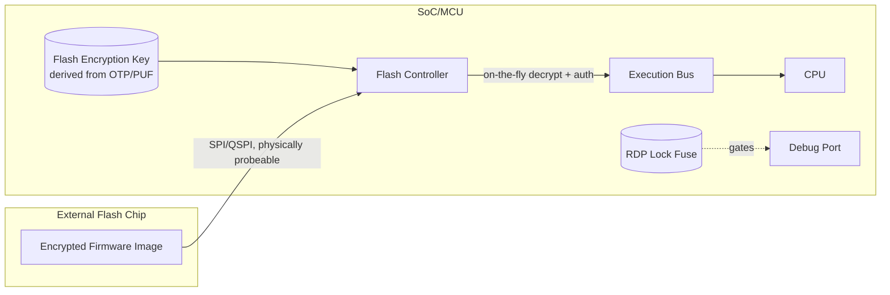
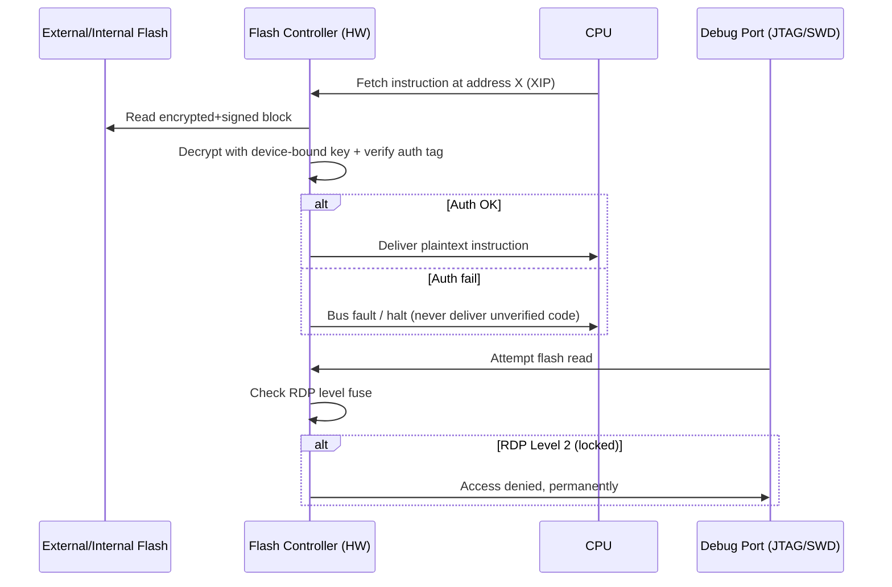

# 06 — Flash Secure Boot

## Concept

Most MCUs (folder 05) and many SoC first/second-stage bootloaders execute
directly out of **external or internal flash memory**. "Flash Secure
Boot" is the specific set of mechanisms that protect **that flash
content itself** — both at rest (readout/tamper protection) and during
boot (authenticated + optionally encrypted execution).

This folder focuses on the flash-specific mechanics that folders
01/02/05 refer to more generally.

### Flash secure boot building blocks

1. **XIP (Execute-In-Place) authentication**
   Many MCUs execute code directly from flash without copying to RAM
   first. Since verifying and then executing from the *same* mutable
   memory opens a TOCTOU window (see 14-attacks-mitigations), designs use
   one of:
   - **Verify-then-lock**: verify entire image, then hardware-lock the
     flash region (read-only bus arbitration) before jumping.
   - **Continuous/streaming authentication**: flash controller verifies
     blocks/pages on-the-fly as they're fetched via the execution bus
     (e.g., encrypted-and-authenticated XIP flash controllers).

2. **Flash encryption (confidentiality)**
   Firmware in external SPI/QSPI flash is visible to anyone with a
   flash-reader/probe. **Flash encryption** (AES, often XTS or CTR mode,
   tied to a per-device key derived from OTP/PUF) prevents IP theft even
   if attacker desolders and reads the flash chip.
   - Encryption protects **confidentiality**; you still need signatures
     for **authenticity/integrity** — the two are complementary
     (see 04-cryptography-basics on AEAD combining both).

3. **Readout Protection (RDP) levels**
   Common in MCU vendors (e.g., STM32 RDP0/1/2): fuse-configurable levels
   that progressively disable debug-port flash reads:
   - **Level 0**: no protection (development).
   - **Level 1**: debugger can't read flash directly, but is reversible
     (mass-erase resets to Level 0).
   - **Level 2**: irreversible — debug port permanently disabled, no
     going back (used for production/shipped devices).

4. **Secure/Non-secure flash regions (TrustZone-M)**
   Flash is partitioned so Non-Secure code physically cannot read the
   Secure region containing the bootloader, keys, or the flash-encryption
   key itself — enforced by the SAU/IDAU + flash controller, not just
   software convention.

5. **External flash-specific risks**
   - **Bus sniffing/replay**: SPI/QSPI bus between SoC and external flash
     chip can be probed; encrypted-and-authenticated bus transactions
     mitigate this (some SoCs support on-the-fly bus encryption).
   - **Chip swap**: attacker desolders flash and replaces with their own
     — signature verification (01/02) is what actually defeats this, not
     encryption alone.

## Diagram





## Pseudo-code — verify-then-lock pattern

```c
int flash_secure_boot_stage(void) {
    /* 1. Copy header + signature (small) to RAM, not whole image */
    image_header_t hdr = flash_read_header(FW_BASE_ADDR);

    /* 2. Verify full image while flash bus is still under our control */
    if (!verify_image_in_flash(FW_BASE_ADDR, hdr.length, hdr.signature))
        return FAIL;

    /* 3. Lock the flash region as read-only / non-writable via bus
          arbitration BEFORE any other bus master (DMA, second core)
          could modify it -- closes the TOCTOU window */
    flash_controller_lock_region(FW_BASE_ADDR, hdr.length);

    /* 4. Only now safe to execute in place */
    jump_to((uintptr_t)(FW_BASE_ADDR + hdr.entry_offset));
    return OK; /* unreachable */
}
```

## Checklist
- [ ] Why is XIP (execute-in-place) more exposed to TOCTOU attacks than
      copy-to-RAM-then-execute?
- [ ] What problem does flash encryption solve that signing does NOT
      (and vice versa)?
- [ ] What is the practical difference between RDP Level 1 and Level 2,
      and why would a production device always ship at the irreversible
      level?
- [ ] Why does encrypting the SPI/QSPI bus itself matter even if the
      flash contents are encrypted at rest?

## Further Reading
`resources/references.md` → STM32 RDP/SBSFU documentation, ESP32 Flash
Encryption + Secure Boot v2 docs, NXP HAB flash security docs.
