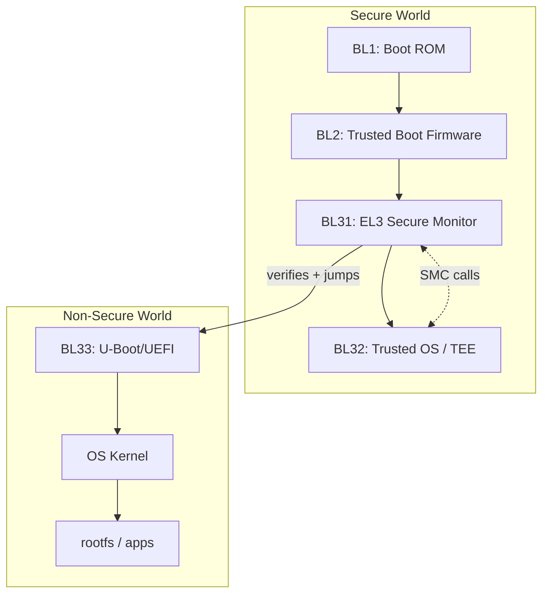
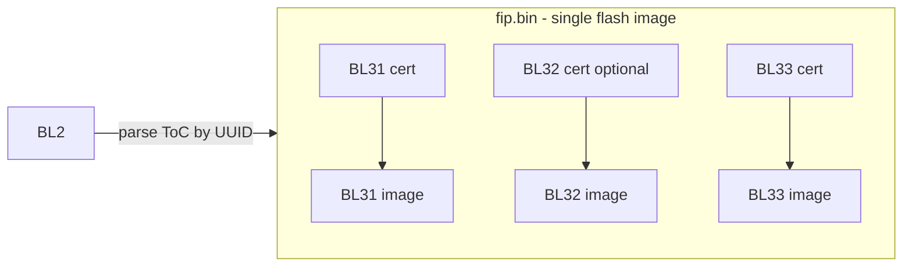
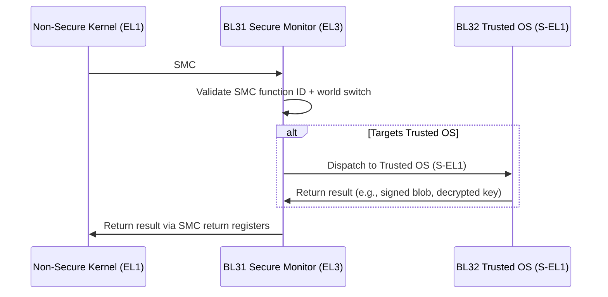
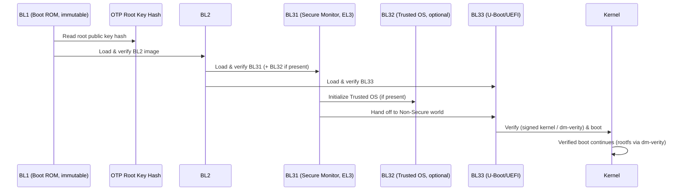
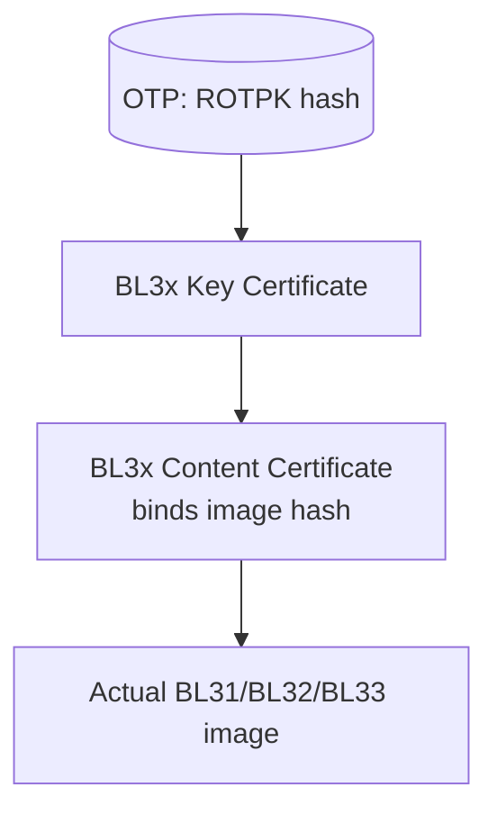
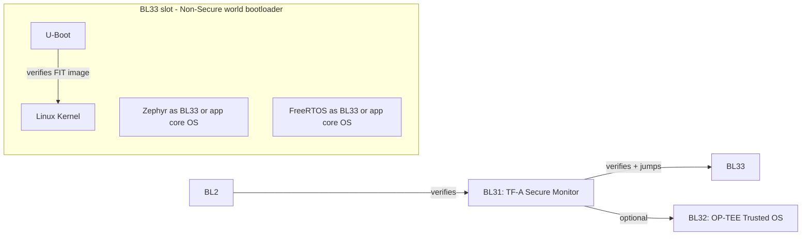

# 07 — SoC Secure Boot (Arm Cortex-A, TrustZone, TF-A)

## Concept

On an **Application Processor SoC** (Cortex-A), secure boot is far more
elaborate than an MCU because there's a rich OS (Linux/Android/QNX), an
MMU, multiple boot media, and multiple execution worlds. Arm's reference
implementation is **ARM Trusted Firmware-A (TF-A)** with the classic
**BL1 → BL2 → BL31 → BL32(optional) → BL33** stage model.

### The BLx stage model
| Stage | Runs in | Role |
|---|---|---|
| **BL1** | Boot ROM (EL3, Secure) | Immutable. Minimal init, loads & verifies BL2. |
| **BL2** | Trusted SRAM (EL3→EL1 Secure) | Loads & verifies BL31, BL32, BL33. Sets up memory map. |
| **BL31** | EL3 (TF-A runtime, Secure Monitor) | Runtime services: PSCI, SMC handling, switches between Secure/Non-Secure worlds. |
| **BL32** | EL1 Secure (optional) | Trusted OS / TEE (e.g., OP-TEE) for secure applications (DRM, key storage). |
| **BL33** | EL2/EL1 Non-Secure | Normal-world bootloader (e.g., U-Boot, UEFI) → loads OS kernel. |

### TrustZone (hardware world isolation)
Cortex-A TrustZone splits the system into **Secure** and **Non-Secure**
worlds at the hardware level (bus, memory, peripherals can be marked
Secure-only). The **Secure Monitor (BL31/EL3)** is the only code that can
switch between worlds, via `SMC` (Secure Monitor Call) instructions.



### Exception Levels (EL) — where each stage actually runs
Arm Cortex-A uses a privilege hierarchy of **Exception Levels**, and
TrustZone doubles it into Secure (S) and Non-Secure (NS) variants:

| EL | Non-Secure | Secure | Typical occupant |
|---|---|---|---|
| EL3 | — (highest privilege is always Secure) | ✅ Secure Monitor | BL1, BL31 (TF-A runtime) |
| EL2 | Hypervisor | Secure Partition Manager (optional) | KVM/Xen (NS), SPM (S, Armv8.4+) |
| EL1 | OS kernel | Trusted OS | Linux/Android kernel (NS), BL32/OP-TEE (S) |
| EL0 | User apps | Trusted Applications (TAs) | Normal apps (NS), TEE TAs (S) |

The **only** code that can move between Secure and Non-Secure worlds is
EL3 (the Secure Monitor / BL31), entered via an `SMC` (Secure Monitor
Call) instruction or an exception. This is the enforced "narrow waist"
of the whole TrustZone security model.

### FIP (Firmware Image Package) — how BL2 finds BL31/BL32/BL33
TF-A packages BL31, BL32, BL33 (and their certificates, in the "Trusted
Board Boot" flow) into a single flash blob called a **FIP**, indexed by
UUID so BL2 can locate each image + its certificate without a filesystem:



### SMC call flow at runtime (not just boot)
Once booted, BL31 keeps running forever at EL3 as the **Secure Monitor**,
servicing `SMC` calls from Non-Secure world (e.g., NS kernel requesting a
CPU power state change via **PSCI**, or a Normal World app asking the TEE
to do a crypto operation):



### Full boot sequence — from Boot ROM to kernel



### TF-A Trusted Board Boot (TBB) — the certificate-based verification detail
TF-A's reference secure boot flow ("Trusted Board Boot") is built entirely
on the **X.509 certificate chain model** from folder 03, with TF-A-specific
certificate roles:

| Certificate | Signed by | Purpose |
|---|---|---|
| **ROTPK** (Root Of Trust Public Key) | N/A — hash lives in OTP/eFuse | Anchors the entire TBB chain |
| **Key certificates** | ROTPK (or a "trusted key" cert) | Authorize a specific *content* certificate's public key (separates "who can sign a key" from "who can sign an image") |
| **Content certificates** | Corresponding key cert's key | Bind a specific image's *hash* (SHA-256) to the chain — one per BL3x image |

This 2-level "key cert → content cert" split lets TF-A rotate the actual
image-signing key without re-issuing the top-level ROTPK-anchored cert,
mirroring folder 03's Root/Intermediate/Leaf pattern almost exactly.




## Pseudo-code — BL2 verifying multiple next-stage images

```c
typedef enum { IMG_BL31, IMG_BL32, IMG_BL33 } image_id_t;

int bl2_load_and_verify_all(void) {
    cert_chain_t root = load_root_cert_from_otp_anchor();

    for (image_id_t id = IMG_BL31; id <= IMG_BL33; id++) {
        image_t *img = fip_load_image(id);          /* from FIP flash partition */
        cert_t  *cert = fip_load_cert(id);

        if (!cert_verify_chain(&root, cert))
            return BL2_ERR_UNTRUSTED_SIGNER;

        if (!image_hash_matches_cert(img, cert))
            return BL2_ERR_INTEGRITY;

        if (img->id == IMG_BL32 && !bl32_present())
            continue;                                 /* optional TEE stage */

        stage_table[id] = img;                          /* mark verified */
    }
    return BL2_OK;
}
```

## Key differences vs MCU (folder 05)
| | MCU | SoC |
|---|---|---|
| Stages | 1 (sometimes 2 w/ A-B) | 4-5 (BL1..BL33) |
| World isolation | TrustZone-M (lightweight) | TrustZone (full MMU, Secure Monitor/EL3) |
| Boot media | Usually 1 internal flash | SPI NOR, eMMC, NAND, UFS, network boot |
| OS | None / RTOS | Full Linux/Android/QNX |
| Runtime services | None | PSCI, SMC, TEE (OP-TEE), DRM |
| Reference impl. | Vendor-specific | ARM Trusted Firmware-A (open source) |

## Where open-source bootloaders/OSes plug into this chain

TF-A defines stages, but **doesn't implement BL33 or the OS itself** —
those are almost always open-source projects. See folder 17 for the full
comparison, but the short version:

- **BL33 slot** is most commonly **U-Boot** (compiled with `CONFIG_TFABOOT`
  or as a UEFI payload) — U-Boot then loads and verifies the Linux
  kernel (`FIT` image signature) before jumping to it.
- On smaller Cortex-A/Cortex-R SoCs without a rich OS, BL33 (or even
  BL32) can instead be **Zephyr** or **FreeRTOS** directly — e.g., a
  safety-island core running Zephyr as a secondary OS alongside Linux
  on the main cores.
- **OP-TEE** (folder 07's BL32 slot) is itself open source and is the de
  facto reference Trusted OS used with TF-A.



## Checklist
- [ ] Name the 5 canonical TF-A boot stages and what each does.
- [ ] What is the Secure Monitor (BL31/EL3) responsible for at runtime,
      not just at boot?
- [ ] Why is BL32 (Trusted OS) optional but BL31 is not?
- [ ] How does dm-verity extend the chain of trust into the running OS
      filesystem?
- [ ] Why is EL3 the only level that can cross the Secure/Non-Secure
      boundary, and why is that a deliberate security design choice?
- [ ] What does a FIP's UUID-indexed Table of Contents let BL2 avoid
      needing (hint: a filesystem)?
- [ ] Give an example of a runtime SMC call and trace which component
      handles it.
- [ ] Why does TF-A separate "key certificates" from "content
      certificates" instead of signing images directly with the ROTPK?
- [ ] Which open-source project typically occupies the BL33 slot, and
      what does it verify before handing off to the kernel?

## Further Reading
`resources/references.md` → ARM Trusted Firmware-A docs (Trusted Board
Boot design, Firmware Image Package spec, Trusted Board Boot certificate
generation tool `cert_create`), Arm TrustZone technology overview, Arm
PSCI specification, Arm SPM/FF-A documentation, OP-TEE documentation,
U-Boot "Verified Boot" documentation. See folder 17 for a deeper
comparison of U-Boot / Zephyr / FreeRTOS secure boot integration.
