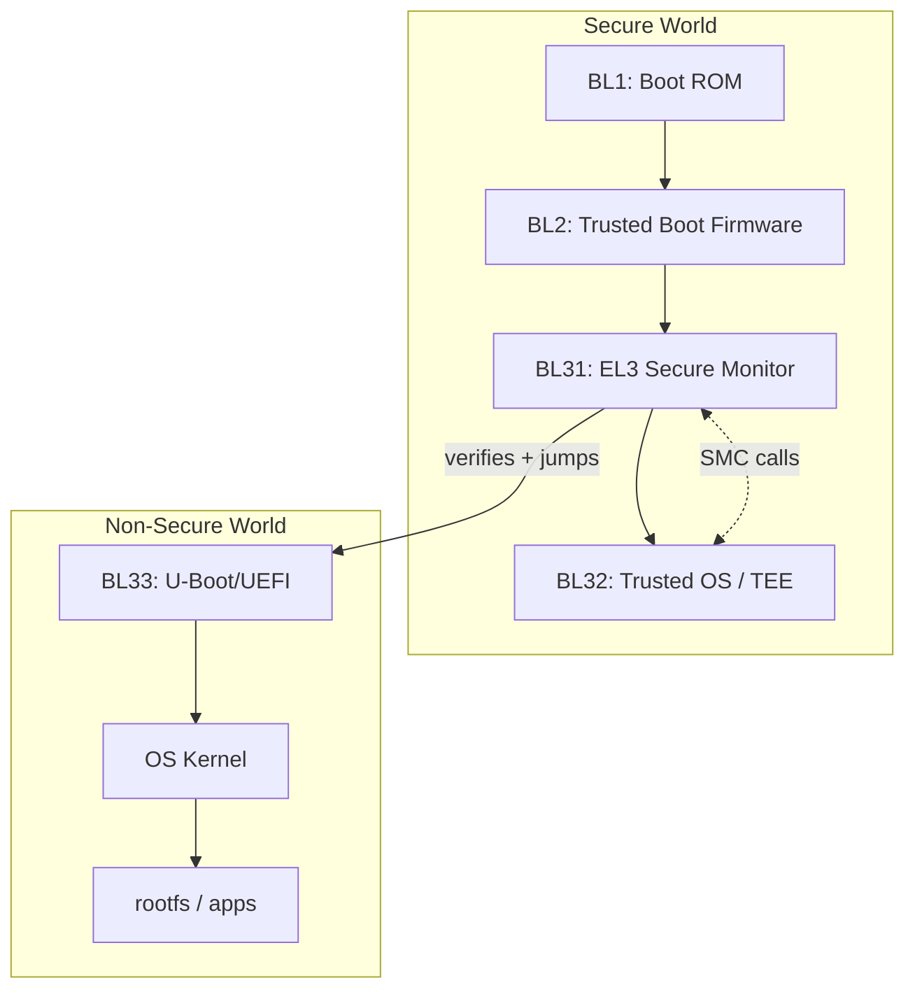
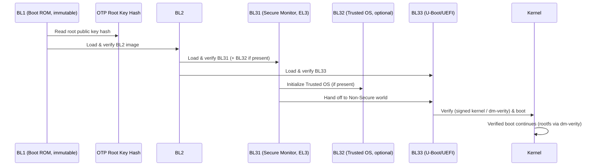

# 04 — SoC Secure Boot (Arm Cortex-A, TrustZone, TF-A)

## Concept

On an **Application Processor SoC** (Cortex-A), secure boot is far more
elaborate than an MCU because there's a rich OS (Linux/Android/QNX), an
MMU, multiple boot media, and multiple execution worlds. Arm's reference
implementation is **ARM Trusted Firmware-A (TF-A)** with the classic
**BL1 → BL2 → BL31 → BL32(optional) → BL33** stage model.

### The BLx stage model
| Stage | Runs in | Role |
|---|---|---|
| **BL1** | Boot ROM (EL3, Secure) | Immutable. Minimal init, loads & verifies BL2. |
| **BL2** | Trusted SRAM (EL3→EL1 Secure) | Loads & verifies BL31, BL32, BL33. Sets up memory map. |
| **BL31** | EL3 (TF-A runtime, Secure Monitor) | Runtime services: PSCI, SMC handling, switches between Secure/Non-Secure worlds. |
| **BL32** | EL1 Secure (optional) | Trusted OS / TEE (e.g., OP-TEE) for secure applications (DRM, key storage). |
| **BL33** | EL2/EL1 Non-Secure | Normal-world bootloader (e.g., U-Boot, UEFI) → loads OS kernel. |

### TrustZone (hardware world isolation)
Cortex-A TrustZone splits the system into **Secure** and **Non-Secure**
worlds at the hardware level (bus, memory, peripherals can be marked
Secure-only). The **Secure Monitor (BL31/EL3)** is the only code that can
switch between worlds, via `SMC` (Secure Monitor Call) instructions.



## Diagram — full sequence



## Pseudo-code — BL2 verifying multiple next-stage images

```c
typedef enum { IMG_BL31, IMG_BL32, IMG_BL33 } image_id_t;

int bl2_load_and_verify_all(void) {
    cert_chain_t root = load_root_cert_from_otp_anchor();

    for (image_id_t id = IMG_BL31; id <= IMG_BL33; id++) {
        image_t *img = fip_load_image(id);          /* from FIP flash partition */
        cert_t  *cert = fip_load_cert(id);

        if (!cert_verify_chain(&root, cert))
            return BL2_ERR_UNTRUSTED_SIGNER;

        if (!image_hash_matches_cert(img, cert))
            return BL2_ERR_INTEGRITY;

        if (img->id == IMG_BL32 && !bl32_present())
            continue;                                 /* optional TEE stage */

        stage_table[id] = img;                          /* mark verified */
    }
    return BL2_OK;
}
```

## Key differences vs MCU (folder 03)
| | MCU | SoC |
|---|---|---|
| Stages | 1 (sometimes 2 w/ A-B) | 4-5 (BL1..BL33) |
| World isolation | TrustZone-M (lightweight) | TrustZone (full MMU, Secure Monitor/EL3) |
| Boot media | Usually 1 internal flash | SPI NOR, eMMC, NAND, UFS, network boot |
| OS | None / RTOS | Full Linux/Android/QNX |
| Runtime services | None | PSCI, SMC, TEE (OP-TEE), DRM |
| Reference impl. | Vendor-specific | ARM Trusted Firmware-A (open source) |

## Checklist
- [ ] Name the 5 canonical TF-A boot stages and what each does.
- [ ] What is the Secure Monitor (BL31/EL3) responsible for at runtime,
      not just at boot?
- [ ] Why is BL32 (Trusted OS) optional but BL31 is not?
- [ ] How does dm-verity extend the chain of trust into the running OS
      filesystem?

## Further Reading
`resources/references.md` → ARM Trusted Firmware-A docs (Trusted Board
Boot design), Arm TrustZone technology overview, OP-TEE documentation.
