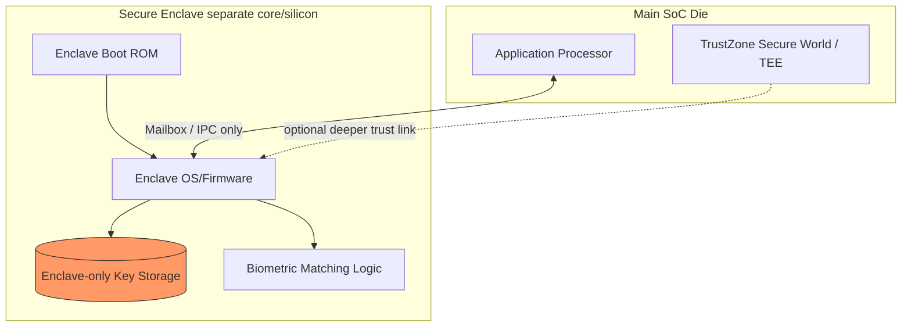
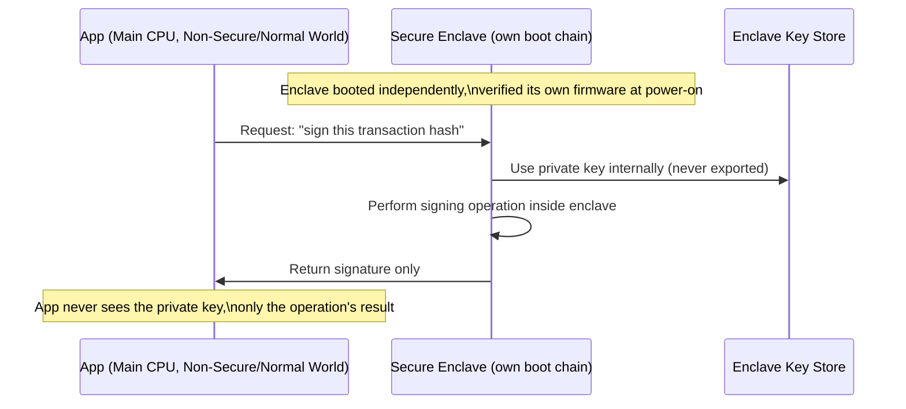

# 08 — Secure Enclave (Isolated Security Coprocessor)

## Concept

A **Secure Enclave** is a *dedicated, physically-separate coprocessor*
(its own CPU core, RAM, boot ROM, and often crypto engine) that runs
independently of the main application processor. It's a stronger
isolation model than TrustZone's "same CPU, different world" approach —
here, security-critical code runs on **different silicon** entirely, with
a narrow, well-defined communication channel (mailbox/IPC) to the main
CPU.

This concept generalizes: Apple's "Secure Enclave Processor (SEP)",
Google Titan M / Titan M2, Samsung Knox's security processor, and generic
"Secure Element (SE)" chips are all instances of this pattern.

### Why a separate coprocessor instead of TrustZone alone?
| | TrustZone (folder 07) | Secure Enclave (separate coprocessor) |
|---|---|---|
| Isolation | Software/hardware world-switch on **same CPU** | **Physically different CPU**, own boot ROM |
| Attack surface if main CPU/OS compromised | Secure Monitor still must be bug-free | Main CPU compromise does **not** directly expose enclave secrets |
| Own boot process | Shares SoC Boot ROM/BL1 | Has its **own independent secure boot chain** |
| Typical use | General TEE (DRM, general secure apps) | High-value secrets: biometric templates, root keys, payment keys |

### What runs inside a Secure Enclave
- Its **own Boot ROM** + chain of trust (mirrors folders 01/02, but on a
  second, smaller chip/core).
- Cryptographic key storage and operations (keys **never leave** the
  enclave — the main CPU sends data in, gets a result out, never sees
  the raw key).
- Sensitive processing: biometric matching (fingerprint/face templates),
  payment tokenization, attestation key operations (folder 12).
- Anti-replay counters and secure storage (often backed by a small
  dedicated secure/encrypted NVRAM independent of main storage).

### Communication model
The main CPU/OS **never has direct access** to enclave internals — only
a narrow, authenticated **mailbox/IPC interface**:
```
Main CPU  <--mailbox/IPC-->  Secure Enclave
   |  sends: "verify fingerprint against enrolled template"
   |  receives: "match" / "no match" (never the raw template)
```

## Diagram





## Pseudo-code — mailbox request/response pattern

```c
/* Runs on the MAIN application processor */
typedef struct { uint8_t op; uint8_t payload[64]; } enclave_request_t;
typedef struct { uint8_t status; uint8_t result[64]; } enclave_response_t;

enclave_response_t ask_enclave_to_sign(const uint8_t *tx_hash, size_t len) {
    enclave_request_t req = { .op = OP_SIGN_HASH };
    memcpy(req.payload, tx_hash, len);

    mailbox_send(&req, sizeof(req));      /* only channel to enclave */
    enclave_response_t resp;
    mailbox_receive(&resp, sizeof(resp)); /* main CPU never sees the key */
    return resp;
}

/* Runs INSIDE the Secure Enclave's own firmware, on its own core */
void enclave_handle_request(const enclave_request_t *req) {
    if (req->op == OP_SIGN_HASH) {
        privkey_t *k = keystore_load_internal(KEY_SLOT_DEVICE_ID); /* never exported */
        uint8_t sig[64];
        ecdsa_sign_p256(k, req->payload, sig);
        mailbox_reply(sig, sizeof(sig));
    }
}
```

## Checklist
- [ ] What's the core isolation difference between TrustZone (folder 07)
      and a physically separate Secure Enclave?
- [ ] Why does the enclave have its **own** independent secure boot
      chain rather than relying on the main SoC's Boot ROM?
- [ ] Why is a narrow mailbox/IPC interface (rather than shared memory)
      important for the security model?
- [ ] Give an example of data that should live in an enclave rather than
      in TrustZone's normal secure world.

## Further Reading
`resources/references.md` → Apple Platform Security Guide (Secure
Enclave chapter), Google Titan M whitepaper, GlobalPlatform Secure
Element specifications.
