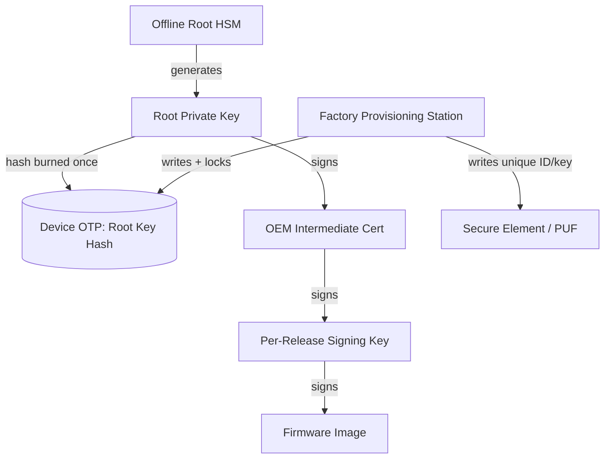

# 09 — Key Management & Provisioning

## Concept

Secure boot is only as strong as the secrecy/integrity of its keys. This
folder covers **where keys live, how they get into the chip, and how they
are protected** across the device lifecycle.

### Key hierarchy (typical)
```
Root Key (offline, HSM, air-gapped)  <-- highest value, rarely touched
   └── Signs: Intermediate/OEM Keys (rotatable)
          └── Signs: Per-image / per-release signing keys
                 └── Signs: Actual firmware images
```
Only the **hash** of the Root public key is ever burned into the chip's
OTP — the root private key itself never leaves the HSM/offline vault.
This lets vendors **rotate lower-level signing keys** without re-fusing
silicon, while the root of trust anchor never changes.

### Where keys/hashes physically live on-device
| Storage | Mutability | Typical use |
|---|---|---|
| **OTP fuses / eFuse** | Write-once (per bit) | Root public-key hash, lifecycle state, debug-disable |
| **Secure element / TPM** | Hardware-protected | Per-device unique keys, attestation keys |
| **PUF (Physical Unclonable Function)** | Derived, not stored | Device-unique secret without storing it at rest |
| **Flash (encrypted)** | Rewritable | Lower-priority keys, certificates |

### Provisioning flow (factory)
1. Chip fabricated with blank OTP.
2. In a secure factory environment (or via a **Secure Provisioning**
   service, e.g. through the silicon vendor), the device receives:
   - Root public-key hash (burned into OTP).
   - A unique device ID / unique key (for attestation, folder 08).
3. OTP is **locked** (write-protect fuse blown) so it can never be
   altered again.
4. Debug ports (JTAG/SWD) are disabled or gated behind authentication.

### Key management do's and don'ts
- ✅ Keep the root private key **offline**, in an **HSM**, with
  multi-person authorization (M-of-N signing ceremony).
- ✅ Use **separate keys per product/SKU** so a leak doesn't compromise
  the whole fleet.
- ✅ Plan for **key rotation** via certificate chains (02) rather than
  needing to re-fuse hardware.
- ❌ Never embed the private key in build scripts / CI without HSM/KMS.
- ❌ Never reuse the same key across unrelated products.

## Diagram — provisioning + key hierarchy



## Pseudo-code — factory provisioning step (conceptual)

```c
/* Runs once, in a controlled factory environment */
int factory_provision(device_handle_t *dev) {
    uint8_t root_pubkey_hash[32];
    load_from_hsm_export(root_pubkey_hash); /* HSM never exports private key */

    if (otp_is_locked(dev)) return ERR_ALREADY_PROVISIONED;

    otp_write(dev, OTP_ROOT_PUBKEY_HASH, root_pubkey_hash, 32);
    otp_write_unique_device_id(dev, generate_unique_id());

    otp_blow_lock_fuse(dev);      /* irreversible: OTP now read-only */
    disable_debug_port_by_default(dev);
    return OK;
}
```

## Checklist
- [ ] Why must the root private key never touch a networked machine?
- [ ] What's the benefit of storing only a *hash* of the public key in
      OTP rather than the full public key?
- [ ] What is a PUF, and why is it attractive vs. storing a raw secret?
- [ ] Why lock OTP / disable debug ports as the last provisioning step?

## Further Reading
`resources/references.md` → PSA Certified "Root of Trust" & provisioning
guidance, Global Platform TEE provisioning docs, HSM/KMS vendor docs
(Thales, AWS CloudHSM, etc.).
