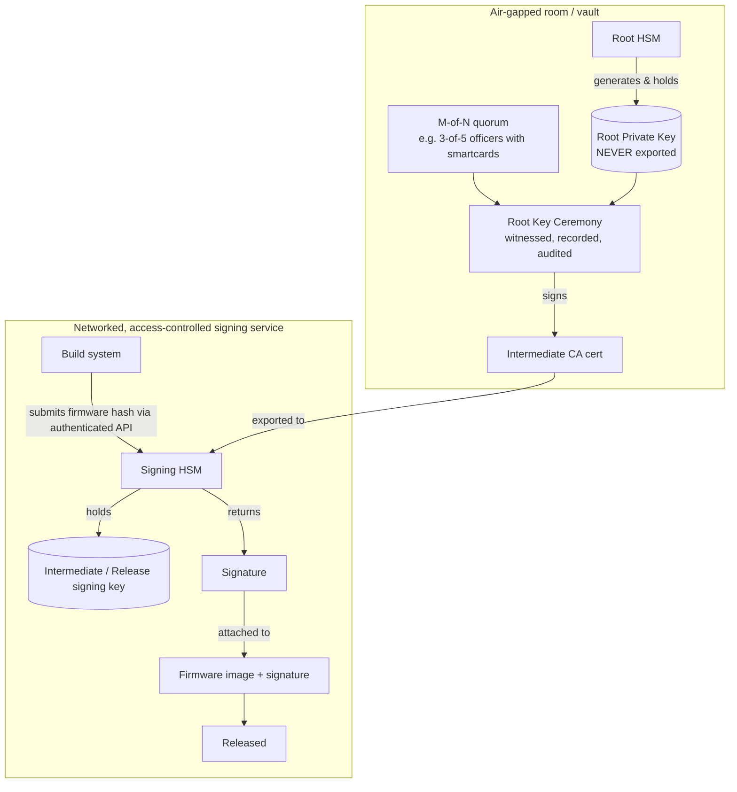
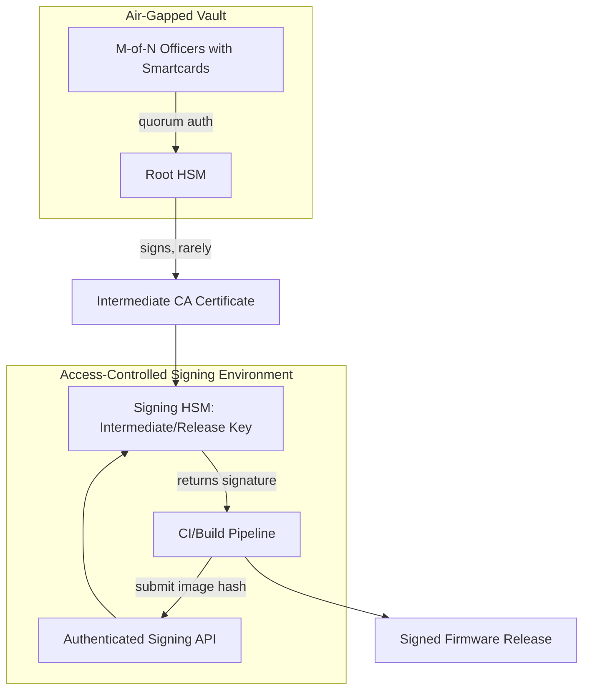
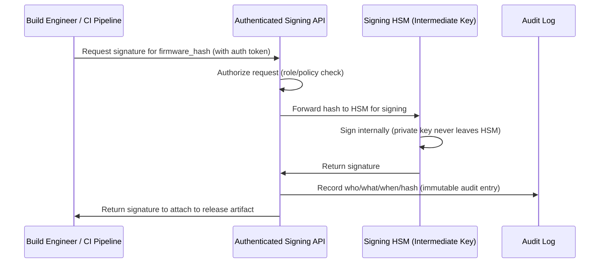

# 10 — HSM Implementation Station

## Concept

Folder 09 explained *what* keys need to exist and *why* the root key must
stay offline. This folder covers the **practical, physical/process
implementation** of an **HSM-based key ceremony and signing station** —
the real-world "station" where root/intermediate keys are generated and
firmware images actually get signed before release.

### What is an HSM?
A **Hardware Security Module** is tamper-resistant/tamper-evident hardware
that:
- Generates private keys **inside its own secure hardware boundary** —
  the private key material is never exposed in plaintext outside it.
- Performs signing/encryption operations internally; callers send data
  in, get a signature/ciphertext out.
- Enforces **access control** (PIN/smartcard/quorum authentication) and
  **audit logging** of every operation.
- Is certified to standards like **FIPS 140-2/3 Level 3+** or
  **Common Criteria** for high-assurance deployments.

### FIPS 140-2 / FIPS 140-3 — what the certification actually means

**FIPS 140** (Federal Information Processing Standard 140) is the US
NIST standard that defines security requirements for **cryptographic
modules** — it's the standard an HSM vendor submits their product
against for independent lab testing (via NIST's **CMVP**, Cryptographic
Module Validation Program). **FIPS 140-3** is the current revision
(adopted 2019, supersedes FIPS 140-2; FIPS 140-2 certs remain valid
until they expire but new submissions are 140-3 only since 2021).
It's built on the international standard **ISO/IEC 19790**.

The standard defines **4 increasing Security Levels** — the level number
you see quoted (e.g., "FIPS 140-2 Level 3") tells you *how* the module
protects keys, not just *that* it does:

| Level | Physical security requirement | Typical implementation | Where you'd see it |
|---|---|---|---|
| **Level 1** | Basic — production-grade components, no tamper mechanisms required | Software crypto libraries (e.g., OpenSSL FIPS module) running on general-purpose hardware | Software-only crypto in non-hostile environments |
| **Level 2** | Adds **tamper-evidence** (seals/coatings that show visible evidence of physical access attempts) + role-based authentication | Basic hardware crypto tokens, entry-level HSM cards | Lower-assurance embedded secure elements |
| **Level 3** | Adds **tamper-*resistance*** (physical barriers actively resisting intrusion) + **identity-based authentication** + **zeroization** of keys on detected tampering | Most commercial HSMs used for root/CA key ceremonies (Thales Luna, Entrust nShield, AWS/Azure CloudHSM) | **This folder's "Root HSM" and "Signing HSM"** |
| **Level 4** | Adds **environmental protection** — detects and reacts to voltage/temperature attacks, full tamper-*detection-and-response* envelope around the whole module | Highest-assurance modules for extreme-threat environments (e.g., some payment/military HSMs) | PCI HSM–certified payment HSMs, some automotive-grade root-of-trust silicon |

**How this maps onto the "Signing Station" in this folder:**
- The **Root HSM** (air-gapped, rarely used, protects the highest-value
  key) should be **FIPS 140-2/3 Level 3 minimum**, often Level 4 for
  regulated industries (payment, government) — physical tamper
  resistance matters most here because a compromise is catastrophic and
  hard to detect quickly.
- The **Signing HSM** (networked, used constantly) is typically
  **Level 3** — the module itself resists physical tampering and
  zeroizes keys if breached, while network-layer controls (auth API,
  access control, audit log — see below) handle the *logical* attack
  surface that physical certification doesn't cover.
- **What FIPS validation does NOT cover**: it certifies the
  *cryptographic module's* physical/logical boundary and algorithm
  correctness — it says nothing about your **key ceremony process**,
  **quorum policy**, or **CI/CD access control**. Those are your
  responsibility to design correctly (this is exactly what the rest of
  this folder covers).
- **Algorithm-level FIPS standards** referenced *inside* a FIPS 140
  validated module: **FIPS 186-5** (Digital Signature Standard — RSA/
  ECDSA/EdDSA), **FIPS 180-4** (Secure Hash Standard — SHA-2 family),
  **FIPS 197** (AES). A Level 3 HSM is validated to *contain and
  correctly execute* these algorithm standards inside its tamper-
  resistant boundary — the level is about *how well protected* the
  execution is, the algorithm standard is about *whether the math is
  correct*.

### The "Signing Station" architecture
A production-grade firmware signing setup typically looks like:



### Key ceremony basics (Root key generation event)
- Conducted in a **controlled, witnessed environment** (often recorded
  on video, with an independent auditor present).
- Uses **M-of-N access control** (e.g., quorum of 3 out of 5 authorized
  officers, each holding a smartcard/token) so no single person can
  extract or misuse the root key.
- Produces a signed **ceremony script/log** as a compliance artifact.
- The HSM itself may be **cloned/backed up** into a redundant unit using
  the HSM's own secure key-wrapping mechanism (key material still never
  appears in plaintext outside HSM boundaries), for disaster recovery.

### Day-to-day signing station operation
- **Root HSM**: stays offline/air-gapped, used *rarely* (e.g., only to
  issue/renew Intermediate CA certs, maybe yearly).
- **Signing HSM(s)**: networked but access-controlled, used *frequently*
  by the CI/build pipeline to sign each firmware release with the
  Intermediate/Release key.
- **Least privilege**: build engineers can *request* a signature via an
  authenticated API/service; they never get direct HSM admin access.
- **Audit trail**: every signing operation logged (who/what/when/which
  image hash) for traceability and incident response.

## Diagram





## Pseudo-code — CI requesting a signature (never touches the private key)

```c
/* Build pipeline side -- has NO access to private key material */
int ci_request_signature(const uint8_t image_hash[32],
                          uint8_t sig_out[64]) {
    signing_api_request_t req = {
        .hash = {0}, .auth_token = load_ci_service_token(),
    };
    memcpy(req.hash, image_hash, 32);

    /* Network call to the signing service fronting the HSM */
    if (signing_api_call(&req, sig_out) != 0)
        return ERR_SIGNING_FAILED;

    /* CI only ever sees the resulting signature, never the key */
    return OK;
}
```

## Checklist
- [ ] What does "the private key never leaves the HSM boundary" actually
      guarantee, and what does it NOT guarantee (e.g., misuse via a
      valid but malicious signing request)?
- [ ] Why use M-of-N quorum authorization for the Root key ceremony
      instead of a single administrator?
- [ ] Why keep the Root HSM air-gapped while the Signing HSM stays
      networked (tie back to folder 03's CA hierarchy)?
- [ ] What audit information should be logged for every signing
      operation, and why does that matter for incident response?
- [ ] What's the difference between FIPS 140-2 Level 3 and Level 4, and
      why would the Root HSM justify a higher level than the Signing HSM?
- [ ] Why doesn't a FIPS 140-3 certificate alone guarantee your key
      ceremony process or CI access control is secure?

## Further Reading
`resources/references.md` → FIPS 140-2/140-3 (Security Requirements for
Cryptographic Modules, NIST CMVP), ISO/IEC 19790 (international basis for
FIPS 140-3), FIPS 186-5 (digital signature algorithms used inside
validated modules), FIPS 180-4 (SHA-2), FIPS 197 (AES), PCI PIN Security /
PCI HSM standards (real-world key ceremony practices), vendor HSM docs
(Thales Luna, AWS CloudHSM, Entrust nShield).
