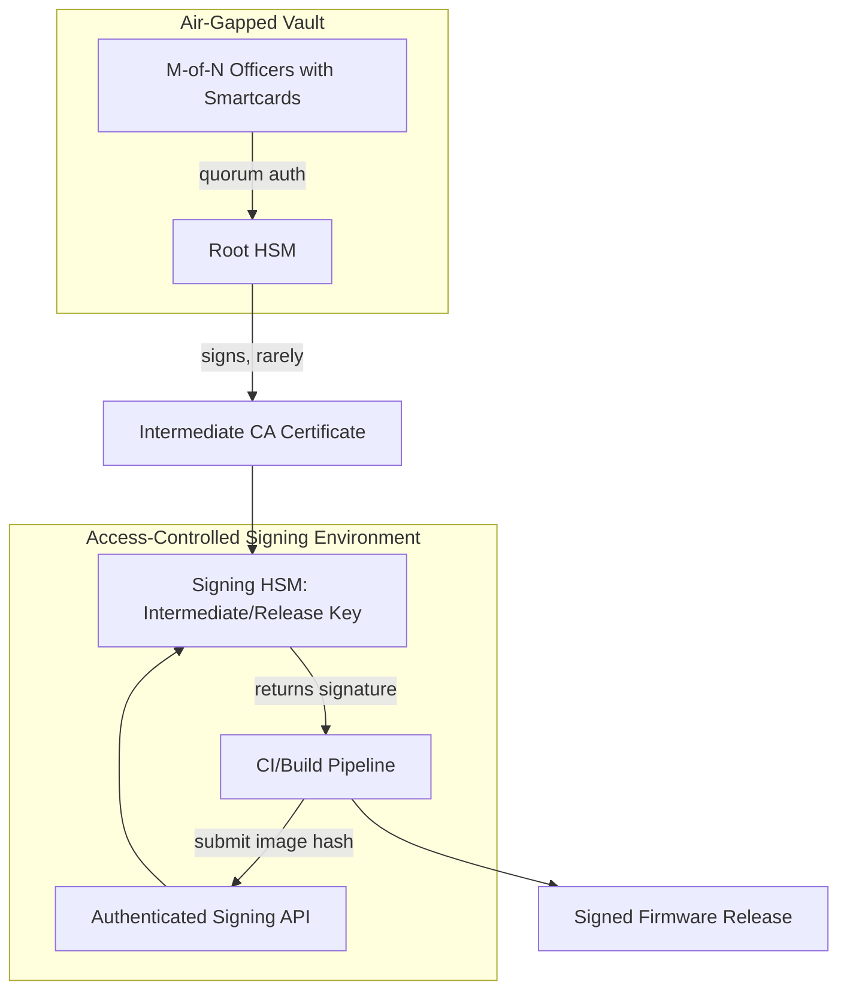
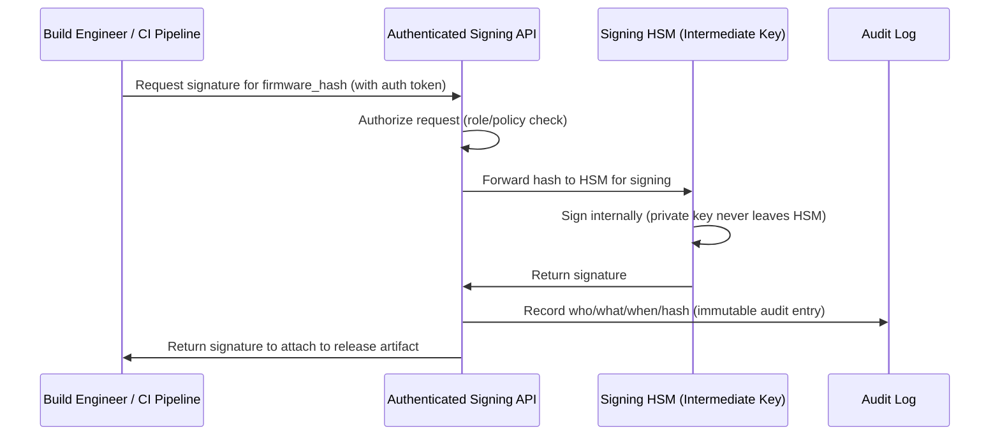

# 10 — HSM Implementation Station

## Concept

Folder 09 explained *what* keys need to exist and *why* the root key must
stay offline. This folder covers the **practical, physical/process
implementation** of an **HSM-based key ceremony and signing station** —
the real-world "station" where root/intermediate keys are generated and
firmware images actually get signed before release.

### What is an HSM?
A **Hardware Security Module** is tamper-resistant/tamper-evident hardware
that:
- Generates private keys **inside its own secure hardware boundary** —
  the private key material is never exposed in plaintext outside it.
- Performs signing/encryption operations internally; callers send data
  in, get a signature/ciphertext out.
- Enforces **access control** (PIN/smartcard/quorum authentication) and
  **audit logging** of every operation.
- Is certified to standards like **FIPS 140-2/3 Level 3+** or
  **Common Criteria** for high-assurance deployments.

### The "Signing Station" architecture
A production-grade firmware signing setup typically looks like:

```
[Air-gapped room / vault]
   Root HSM  ---(generates & holds)--->  Root Private Key (NEVER exported)
        |
        | (M-of-N quorum: e.g. 3-of-5 officers with smartcards)
        v
   Root Key Ceremony (witnessed, recorded, audited)
        |
        v
   Signs: Intermediate CA cert  ---> exported to networked Signing HSM

[Networked, access-controlled signing service]
   Signing HSM  ---(holds)--->  Intermediate/Release signing key
        |
        | (Build system submits firmware hash via authenticated API)
        v
   Returns: signature  --->  attached to firmware image --->  released
```

### Key ceremony basics (Root key generation event)
- Conducted in a **controlled, witnessed environment** (often recorded
  on video, with an independent auditor present).
- Uses **M-of-N access control** (e.g., quorum of 3 out of 5 authorized
  officers, each holding a smartcard/token) so no single person can
  extract or misuse the root key.
- Produces a signed **ceremony script/log** as a compliance artifact.
- The HSM itself may be **cloned/backed up** into a redundant unit using
  the HSM's own secure key-wrapping mechanism (key material still never
  appears in plaintext outside HSM boundaries), for disaster recovery.

### Day-to-day signing station operation
- **Root HSM**: stays offline/air-gapped, used *rarely* (e.g., only to
  issue/renew Intermediate CA certs, maybe yearly).
- **Signing HSM(s)**: networked but access-controlled, used *frequently*
  by the CI/build pipeline to sign each firmware release with the
  Intermediate/Release key.
- **Least privilege**: build engineers can *request* a signature via an
  authenticated API/service; they never get direct HSM admin access.
- **Audit trail**: every signing operation logged (who/what/when/which
  image hash) for traceability and incident response.

## Diagram





## Pseudo-code — CI requesting a signature (never touches the private key)

```c
/* Build pipeline side -- has NO access to private key material */
int ci_request_signature(const uint8_t image_hash[32],
                          uint8_t sig_out[64]) {
    signing_api_request_t req = {
        .hash = {0}, .auth_token = load_ci_service_token(),
    };
    memcpy(req.hash, image_hash, 32);

    /* Network call to the signing service fronting the HSM */
    if (signing_api_call(&req, sig_out) != 0)
        return ERR_SIGNING_FAILED;

    /* CI only ever sees the resulting signature, never the key */
    return OK;
}
```

## Checklist
- [ ] What does "the private key never leaves the HSM boundary" actually
      guarantee, and what does it NOT guarantee (e.g., misuse via a
      valid but malicious signing request)?
- [ ] Why use M-of-N quorum authorization for the Root key ceremony
      instead of a single administrator?
- [ ] Why keep the Root HSM air-gapped while the Signing HSM stays
      networked (tie back to folder 03's CA hierarchy)?
- [ ] What audit information should be logged for every signing
      operation, and why does that matter for incident response?

## Further Reading
`resources/references.md` → FIPS 140-3 (HSM security requirements),
PCI PIN Security / PCI HSM standards (real-world key ceremony practices),
vendor HSM docs (Thales Luna, AWS CloudHSM, Entrust nShield).
