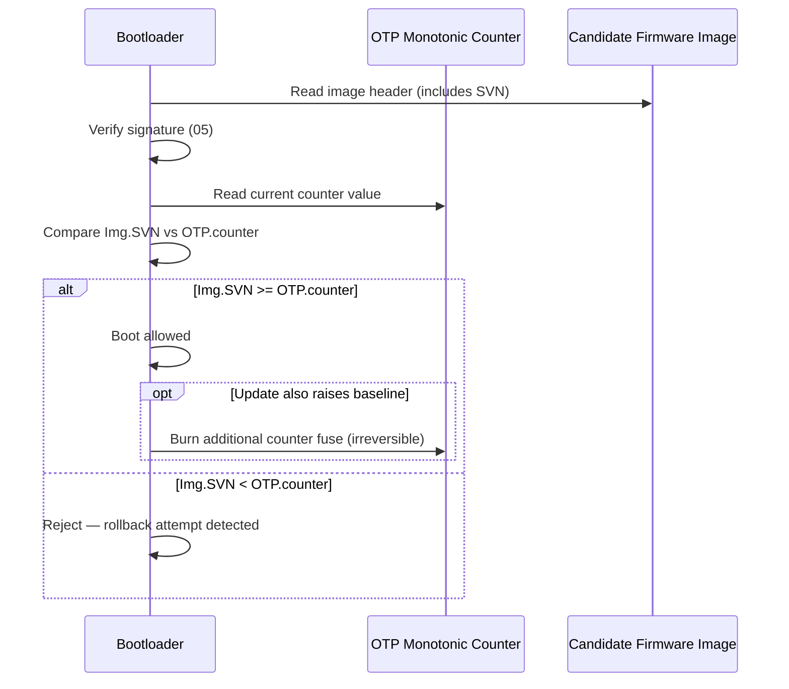

# 07 — Anti-Rollback & Versioning

## Concept

Signature verification alone doesn't stop an attacker from re-flashing a
**legitimately signed, but OLDER, vulnerable** firmware image (a
"downgrade" or "rollback" attack) to reintroduce a fixed vulnerability.
**Anti-rollback** defends against this using a **monotonic counter**.

### How it works
1. Every signed image embeds a **Security Version Number (SVN)** — not
   the same as the marketing/build version, specifically tracks security
   fixes.
2. The device stores a **monotonic counter** (only increments, never
   decrements) in OTP fuses or a secure monotonic-counter peripheral.
3. On boot, after signature verification succeeds, compare:
   `image.SVN >= device.counter` → allow boot.
   If the image also **raises the bar** (`image.SVN > device.counter`),
   the device may bump the counter (usually done deliberately during an
   update, not silently every boot).
4. OTP fuses are perfect for this: a fuse bank can represent a counter by
   burning additional bits (write-once = can only go up).

### Design considerations
- **Granularity**: too fine-grained (bump on every release) burns fuses
  fast (limited number of OTP bits!). Usually SVN increments only on
  security-relevant releases, not every build.
- **Separate from feature version**: SVN != app version. A device can
  stay on an old *feature* version while still meeting a new *security*
  baseline (patch-only backport).
- **Per-component counters**: BL2, BL31, BL33, TEE, and kernel may each
  have independent rollback counters in complex SoCs, so a compromise in
  one component's history doesn't block updates to another.

## Diagram



## Pseudo-code

```c
typedef struct {
    uint32_t security_version;   /* SVN, distinct from feature version */
    /* ... signature, hash, etc. */
} image_header_t;

bool anti_rollback_check(const image_header_t *hdr) {
    uint32_t current = otp_read_monotonic_counter();

    if (hdr->security_version < current) {
        log_security_event("Rollback attempt blocked");
        return false;
    }
    /* Do NOT auto-bump on every boot — only during a deliberate,
       verified update flow, to avoid burning fuses on every reset. */
    return true;
}

void on_verified_firmware_update(const image_header_t *hdr) {
    uint32_t current = otp_read_monotonic_counter();
    if (hdr->security_version > current) {
        otp_bump_monotonic_counter(hdr->security_version); /* one-way */
    }
}
```

## Checklist
- [ ] Why is "just verify the signature" not sufficient to prevent
      downgrade attacks?
- [ ] Why should the rollback counter increment only on deliberate
      updates, not every boot?
- [ ] Why might a SoC need independent counters per boot component
      (BL2 vs kernel vs TEE)?
- [ ] What's the practical limit of OTP-fuse-based counters, and how do
      designs work around limited fuse bits (e.g., bit-field counters,
      counter-of-counters)?

## Further Reading
`resources/references.md` → NIST SP 800-193 (firmware resiliency,
rollback protection), Android Verified Boot (AVB) rollback index docs.
