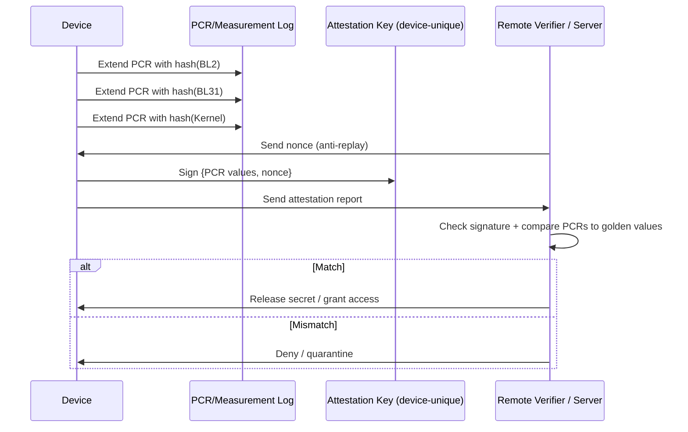

# 08 — Attestation & Measured Boot

## Concept

Secure boot (folders 01-04) answers: *"did I only run authorized code?"*
**Measured boot + attestation** answers a different, complementary
question: *"can I **prove to someone else** (a server, another device)
what code actually ran on me?"*

### Measured boot
Instead of (or in addition to) blocking unauthorized code, each stage
**records a hash ("measurement")** of the next stage into a
tamper-evident, append-only log/register **before** executing it —
even if execution isn't blocked on failure (useful for auditing / TEE
attestation more than strict secure boot).
- On TPM-based systems: measurements go into **PCRs (Platform
  Configuration Registers)** — each PCR = `PCR_new = Hash(PCR_old ||
  new_measurement)`, so history can't be forged, only extended.
- On Arm systems: similar concept via TF-A's **Measured Boot** support,
  feeding into an "Event Log" + a TPM or a software-only equivalent.

### Attestation
The device proves its measured state to a **remote verifier** (e.g., a
cloud service) using a signed **attestation report**:
1. Device holds a **device-unique attestation key** (provisioned in
   folder 06, ideally hardware-bound / derived from a PUF).
2. Device signs: `{ measurements (PCRs / hashes), nonce from verifier }`.
3. Verifier checks the signature against a known-good device identity
   and compares measurements against an **allow-list of expected
   good hashes** ("golden measurements").
4. Only if everything matches does the verifier grant the device access
   to a secret/service (e.g., decryption key, cloud API token).

### Secure boot vs Measured boot — not mutually exclusive
| | Secure Boot | Measured Boot |
|---|---|---|
| Goal | Prevent running bad code | Prove what code ran |
| Failure action | Halt / block boot | Usually still boots, but records failure/mismatch |
| Needs remote verifier? | No | Yes, for attestation to be useful |
| Typical HW | OTP + crypto engine | TPM / secure counter+key store |

Many real systems use **both**: secure boot blocks obviously bad images,
while measured boot + attestation lets a backend server verify a much more
detailed state before releasing sensitive secrets (e.g., DRM keys, cloud
VM secrets, banking apps).

## Diagram



## Pseudo-code

```c
/* Called by each boot stage before executing the next */
void measure_and_extend(pcr_bank_t *pcrs, int index,
                         const uint8_t *next_stage, size_t len) {
    uint8_t measurement[32];
    sha256(next_stage, len, measurement);
    /* PCR extend: new = hash(old || measurement), never simply overwritten */
    pcr_extend(pcrs, index, measurement);
    event_log_append(index, measurement);
}

/* Later, when a verifier challenges the device */
attestation_report_t generate_attestation(const pcr_bank_t *pcrs,
                                           const uint8_t *nonce,
                                           const device_key_t *attest_key) {
    attestation_report_t report;
    report.pcr_values = pcr_bank_snapshot(pcrs);
    report.nonce = *nonce;                     /* prevents replay */
    sign_report(attest_key, &report);
    return report;
}
```

## Checklist
- [ ] What question does measured boot answer that secure boot alone
      doesn't?
- [ ] Why does a PCR "extend" operation (hash chaining) rather than
      simple overwrite matter for tamper-evidence?
- [ ] Why must the verifier send a fresh nonce each time?
- [ ] Where does the device's attestation key come from, and why must it
      be hardware-bound (tie back to folder 06)?

## Further Reading
`resources/references.md` → TCG TPM 2.0 spec (PCR concepts), Arm PSA
Attestation API, RFC 9334 (Remote ATtestation procedureS, RATS
architecture).
