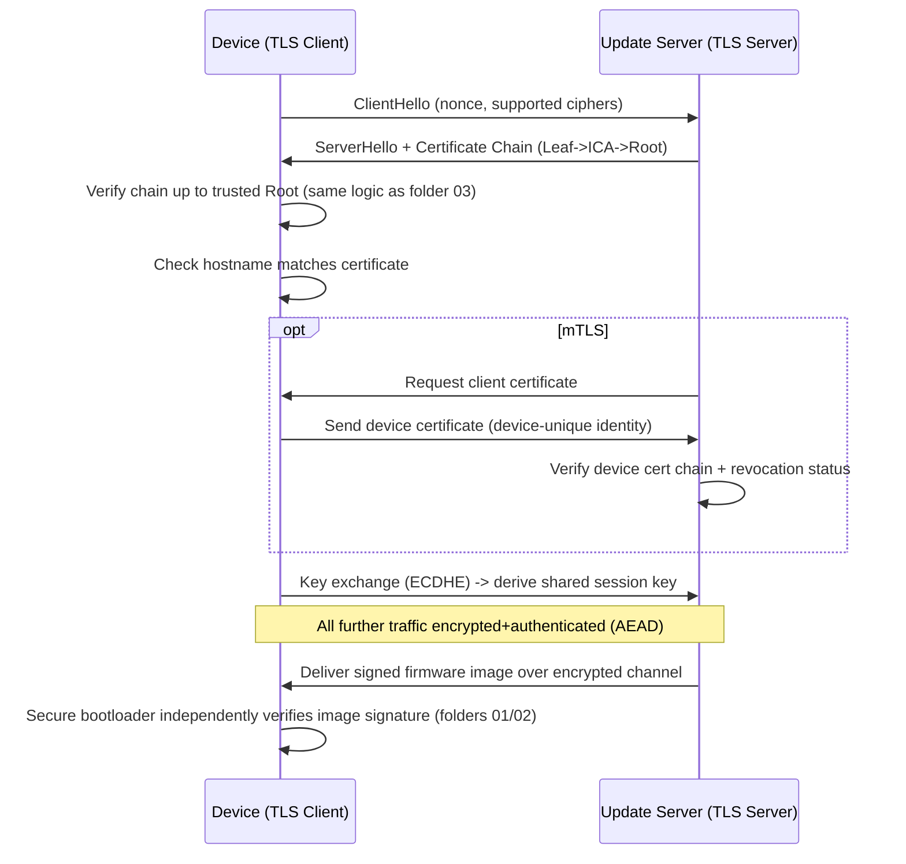
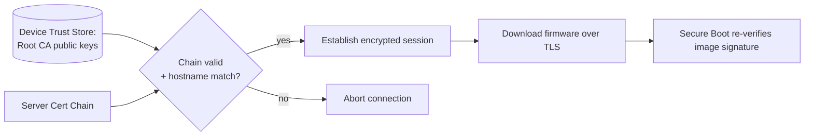

# 13 — SSL/TLS Concept (and its relation to Secure Boot)

## Concept

Secure boot (01-12) is about trusting **local, static code** at power-on.
**SSL/TLS** is the analogous trust model applied to **network
communication** — and understanding it reinforces every PKI concept
already used in secure boot (certificates, chains, signatures), while
also being the mechanism that protects things like **secure firmware
OTA (Over-The-Air) updates** and **attestation traffic** (folder 12).

### Why study TLS here?
- Same **certificate chain** trust model as folder 03 (Root CA →
  Intermediate → Leaf), just applied to a server's identity instead of a
  firmware image.
- Devices commonly use TLS to **download firmware updates** securely —
  secure boot then verifies the downloaded image's *own* signature
  independently (defense in depth: don't rely on TLS alone for firmware
  authenticity).
- Devices doing remote **attestation** (folder 12) send their signed
  reports to a verifier over TLS — attestation identity and transport
  security are separate but complementary layers.

### TLS handshake — the short version
1. **ClientHello**: client proposes supported crypto/versions + a random
   nonce.
2. **ServerHello + Certificate**: server sends its certificate chain
   (Leaf → Intermediate → up to a Root the client already trusts, e.g.
   from an OS/embedded trust store).
3. **Certificate verification**: client verifies chain up to a trusted
   Root (identical logic to folder 03's CA chain verification!), and
   checks the hostname matches.
4. **Key exchange** (e.g., ECDHE): both sides derive a shared session key
   without ever transmitting it directly (forward secrecy).
5. **Finished**: both sides confirm the handshake integrity using a MAC
   over the whole transcript.
6. All further traffic encrypted+authenticated with the session key
   (AEAD, e.g., AES-GCM or ChaCha20-Poly1305).

### mTLS (mutual TLS) — used for device-to-cloud secure boot ecosystems
- Standard TLS only authenticates the **server** to the client.
- **mTLS**: the **device also presents its own certificate** (often
  backed by a device-unique key from folder 09/08's secure
  storage/enclave), so the server can verify *which specific device* is
  connecting — critical for fleet management, secure OTA delivery, and
  attestation.

### Where TLS fits alongside secure boot in a real device lifecycle
```
1. Device boots -> secure boot chain (01-07) verifies local firmware.
2. Device connects to update server over TLS/mTLS (this folder).
3. Server verified via cert chain (mirrors folder 03).
4. Device identity verified via device cert / attestation (folders 08/12).
5. New firmware image downloaded over the encrypted TLS channel.
6. Secure bootloader independently verifies the NEW image's signature
   (never trust "it came over TLS" as a substitute for image signing!).
```

## Diagram





## Pseudo-code — conceptual TLS cert chain check (mirrors folder 03)

```c
bool tls_verify_server_chain(const trust_store_t *device_trust_store,
                              const cert_t *leaf, const cert_t *ica,
                              const cert_t *root, const char *hostname) {
    /* Same pattern as CA hierarchy verification (03) */
    if (!trust_store_contains(device_trust_store, root))
        return false;                      /* unknown Root, reject */

    if (!cert_signature_valid(root->pubkey, ica))
        return false;

    if (!cert_signature_valid(ica->pubkey, leaf))
        return false;

    if (!hostname_matches_cert(leaf, hostname))
        return false;                      /* prevents MITM via valid-but-wrong cert */

    return true;
}

/* After TLS download completes -- NEVER skip this just because TLS succeeded */
bool post_download_integrity_check(const image_t *downloaded_fw) {
    return device_verify_image(downloaded_fw->data, downloaded_fw->len,
                                otp_get_pubkey(), downloaded_fw->signature);
}
```

## Checklist
- [ ] Why is verifying a TLS certificate chain conceptually identical to
      verifying a firmware CA chain (folder 03)?
- [ ] Why must a device still verify the firmware's own signature after
      downloading it over TLS, instead of trusting TLS alone?
- [ ] What extra guarantee does mTLS provide over standard one-way TLS,
      and why does it matter for fleet/device management?
- [ ] Where would a device's mTLS client certificate best be stored
      (tie back to folders 08 Secure Enclave / 09 Key Management)?

## Further Reading
`resources/references.md` → RFC 8446 (TLS 1.3), RFC 5280 (X.509 PKI),
mTLS in IoT device management best practices (AWS IoT / Azure IoT Hub
device provisioning docs as real-world examples).
