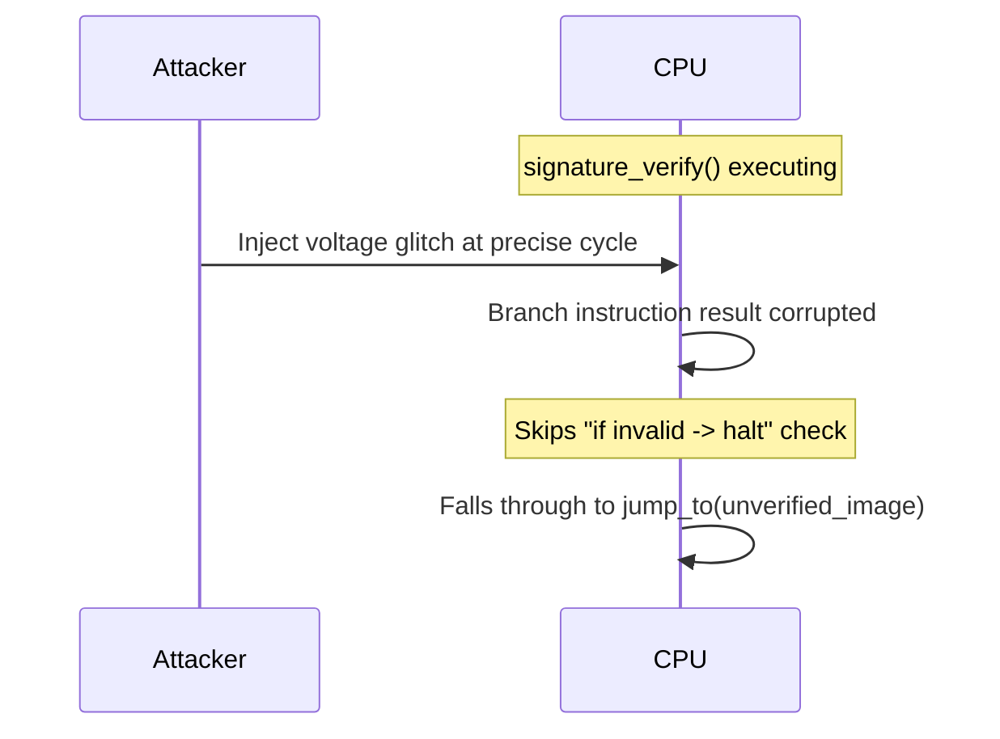

# 09 — Attacks & Mitigations

## Concept

Understanding secure boot theory isn't complete without studying how it
actually gets broken in practice, and how designs harden against those
attacks. This is the "red team" lens on everything in folders 00-08.

### Attack categories

#### 1. Fault injection / glitching
Physically disturbing the chip (voltage glitch, clock glitch, EM pulse,
laser) at the exact moment a security check executes, to make a
`branch-if-not-equal` skip or a comparison return the wrong result.
- **Classic target**: the single `if (signature_valid)` branch.
- **Mitigation**: redundant checks (verify twice, compare results),
  control-flow integrity, random delays before/after checks, hardware
  glitch detectors that reset the chip, avoiding single-point-of-failure
  branches (e.g., using constant-time, branchless comparisons).

#### 2. TOCTOU (Time-Of-Check to Time-Of-Use)
Verify image A, but then execute image B (attacker swaps the flash
content between verify and jump, e.g., via DMA or a race with an external
flash chip).
- **Mitigation**: verify-in-place execution (XIP with continuous
  authentication), or copy-then-verify-then-execute from a location the
  attacker cannot modify after the check (e.g., internal SRAM), memory
  bus locking during verification.

#### 3. Downgrade / rollback attacks
Covered in depth in folder 07 — replaying an old, validly-signed but
vulnerable image.

#### 4. Key/secret extraction
- **Side-channel attacks** (power analysis / DPA, timing attacks) on the
  signature verification or key-derivation routines to leak key material.
- **Debug port abuse** (JTAG/SWD left enabled) to read out flash/OTP or
  single-step through boot code.
- **Mitigation**: constant-time crypto implementations, masking/blinding
  in crypto libraries, disabling debug ports by default with
  authenticated re-enable, physical anti-tamper packaging for
  high-assurance devices.

#### 5. Confused deputy / wrong trust anchor
Boot ROM accepts a key that *is* validly formatted but was never meant to
be trusted (e.g., verifying against an application-supplied key instead
of the OTP-anchored one). Emphasizes why 02's "trust anchor in OTP, never
in the image" rule matters.

#### 6. Boot ROM bugs (can't be patched!)
Because Boot ROM is immutable, any bug found post-fab is permanent
(unless a secondary "ROM patch" mechanism, itself authenticated, exists).
Historical real-world examples: NVIDIA Tegra "ShofEL"/fusée gelée exploit
(USB control transfer length-check bug in Boot ROM), various vendor
Secure Boot bypass CVEs.
- **Mitigation**: extremely thorough Boot ROM review/formal verification
  before tape-out, minimal Boot ROM logic (smaller attack surface),
  authenticated ROM-patch mechanisms for post-fab fixes.

## Diagram — glitch attack window



## Mitigation cheat-sheet
| Attack | Primary Mitigation |
|---|---|
| Glitching a single check | Redundant/double verification, branchless compare, glitch detectors |
| TOCTOU | Verify-then-lock, copy to protected internal memory before verify |
| Rollback | Monotonic counters (07) |
| Side-channel key leak | Constant-time crypto, masking, disable debug by default |
| Confused deputy | Trust anchor only from OTP, never from the image itself |
| Boot ROM bugs | Rigorous review, authenticated patch mechanism, minimal ROM code |

## Pseudo-code — hardening a single check against glitching

```c
/* Naive (vulnerable to a single glitch skipping the branch) */
if (!signature_valid) {
    halt();
}
jump_to(image);

/* Hardened: redundant check + explicit fail-safe default */
volatile int check1 = signature_verify(image);
volatile int check2 = signature_verify(image);  /* re-derive, don't cache */
if (check1 != 1 || check2 != 1 || check1 != check2) {
    secure_halt_no_return();   /* infinite loop / hw reset, not a simple return */
}
/* Only reached if BOTH checks agree AND both equal the "valid" sentinel */
jump_to(image);
```

## Checklist
- [ ] Why is a single `if` branch a weak point against fault injection?
- [ ] How does TOCTOU differ from a straightforward signature bypass?
- [ ] Why can Boot ROM bugs be especially catastrophic compared to bugs
      in later, updatable stages?
- [ ] Name one real-world documented secure boot bypass and what root
      cause enabled it.

## Further Reading
`resources/references.md` → "Fault injection attacks on cryptographic
devices" surveys, Fusée Gelée (Tegra X1) writeup, riscure/ChipWhisperer
glitching resources, NIST SP 800-193.
