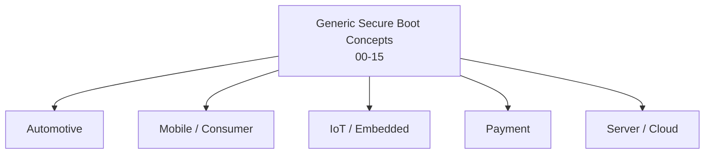

# 16 — Secure Boot Standards by Domain

## Concept

Everything in folders 00-15 is **vendor/domain-agnostic**. In practice,
each industry layers its own **certification standards, evaluation
schemes, and mandatory requirements** on top of these generic secure boot
concepts. This folder maps the generic concepts to the standards you'll
actually be asked to comply with, per domain.

---

## 1. Automotive

| Standard | Scope | Relates to |
|---|---|---|
| **ISO/SAE 21434** | Road vehicles cybersecurity engineering — requires a documented cybersecurity lifecycle, threat analysis & risk assessment (TARA) covering secure boot as a control | 00 (threat model), 14 (attacks) |
| **ISO 26262** | Functional safety (ASIL levels) — secure boot failures must be analyzed for safety impact, not just security | 00, 07 |
| **UNECE R155 / R156** | Regulatory requirement (EU/UN) for cybersecurity management systems (CSMS) and software update management systems (SUMS) — mandates secure, authenticated OTA updates | 11 (anti-rollback), 13 (SSL/TLS for OTA) |
| **AUTOSAR SecOC / CSM** | AUTOSAR's Secure Onboard Communication + Crypto Service Manager modules — how ECUs handle keys/crypto operations in practice | 04, 09 |
| **HSM profiles (EVITA Full/Medium/Light)** | Automotive-specific HSM classification for in-ECU hardware security modules | 09, 10 |

**Practical note:** automotive ECUs are essentially the **MCU secure
boot** model (folder 05) multiplied across dozens of ECUs per vehicle,
each needing its own key hierarchy (folder 03) and secure OTA update
path (folder 13) coordinated at the vehicle/fleet level.

## 2. Mobile / Consumer Electronics

| Standard / Mechanism | Scope | Relates to |
|---|---|---|
| **Android Verified Boot (AVB)** | Google's dm-verity + rollback-index based verified boot for Android devices | 07, 11, 12 |
| **Apple Secure Boot Chain / Secure Enclave** | Apple's documented boot chain (Boot ROM → LLB → iBoot → kernel) + SEP as a hardware secure enclave | 07, 08 |
| **PSA Certified (Arm)** | Platform Security Architecture — tiered certification (Level 1/2/3) for IoT/mobile chips & OSes, covering RoT, attestation, secure boot | 00, 02, 12 |
| **GlobalPlatform TEE / SE specs** | Standardizes Trusted Execution Environment and Secure Element APIs used across mobile chipsets | 08, 09 |
| **FIDO Alliance (device attestation)** | Attestation format used for authenticator/biometric hardware, builds on measured boot concepts | 12 |

## 3. IoT / Embedded

| Standard | Scope | Relates to |
|---|---|---|
| **PSA Certified (Arm)** | Same as above — very common baseline target for Cortex-M IoT MCUs | 05, 06 |
| **NIST IR 8259 / SP 800-193** | US NIST baseline cybersecurity + platform firmware resiliency (detect/protect/recover) guidance for IoT | 00, 14 |
| **ETSI EN 303 645** | EU baseline requirements for consumer IoT security (no default passwords, secure update, etc.) — secure boot supports the "verified software update" provision | 11, 13 |
| **IEC 62443** | Industrial control systems security (includes component-level secure boot expectations for industrial IoT/OT devices) | 00, 09 |
| **Matter / CSA (Connectivity Standards Alliance)** | Smart-home interoperability standard with device attestation requirements (Device Attestation Certificate, DAC) | 03, 12 |

## 4. Payment / Financial

| Standard | Scope | Relates to |
|---|---|---|
| **PCI PTS (PIN Transaction Security)** | Physical + logical security requirements for payment terminals, including secure boot of the terminal firmware | 06, 09 |
| **PCI HSM** | Security requirements specifically for HSMs used in payment key management | 10 |
| **EMVCo Security Requirements** | Chip card / terminal specifications, including key management and secure element requirements | 03, 08, 09 |
| **Common Criteria (CC) EAL4+/EAL5+/EAL6+** | Formal security evaluation scheme often required for payment secure elements/HSMs | 08, 10 |
| **FIPS 140-2/140-3** | US federal crypto module validation, commonly mandated for HSMs used in payment/root key ceremonies | 10 |

## 5. Server / Cloud / Data Center

| Standard | Scope | Relates to |
|---|---|---|
| **UEFI Secure Boot** | PC/server firmware secure boot standard (db/dbx key databases, Secure Boot policy) — the x86 server/PC analogue of folders 01/02 | 01, 02, 03 |
| **TCG TPM 2.0** | Trusted Platform Module spec underlying measured boot + remote attestation in servers/VMs | 12 |
| **DMTF SPDM** | Security Protocol and Data Model — standardizes attestation/measurement exchange between hardware components (e.g., NIC, GPU) and host | 12 |
| **NIST SP 800-193** | Platform firmware resiliency (also applies to servers: detect/protect/recover firmware) | 11, 14 |
| **Confidential Computing (CCC)** | Standards for attesting/isolating VM memory (Intel TDX, AMD SEV-SNP, Arm CCA) — measured boot extended into VM launch | 08, 12 |

---

## How to use this folder

For any project, identify your **domain**, then:
1. Find your mandatory standard(s) in the table above.
2. Cross-reference the folder(s) listed — that's the generic concept the
   standard is layering requirements on top of.
3. Read the standard's actual text for the compliance-specific details
   (audit evidence, certification levels, required test labs) — this
   repo teaches the *underlying mechanism*, not the paperwork.

## Checklist
- [ ] For your target domain, name the primary cybersecurity standard
      and the primary safety standard (if applicable) that apply.
- [ ] Which folder's concept does your domain's OTA/update requirement
      map to (hint: 11 + 13)?
- [ ] Which certification scheme would your HSM/secure element need
      (FIPS 140-3? Common Criteria? PCI HSM?) and why does that depend
      on the domain (payment vs. generic IoT)?

## Further Reading
`resources/references.md` → ISO/SAE 21434, UNECE R155/R156, PSA
Certified documentation, NIST SP 800-193 / IR 8259, ETSI EN 303 645,
PCI PTS/HSM standards, EMVCo security guidelines, UEFI Secure Boot
specification, TCG TPM 2.0, DMTF SPDM.
