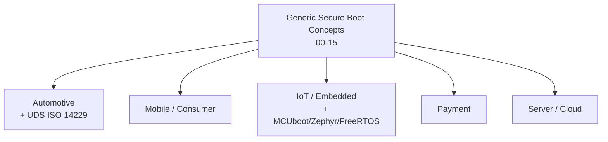
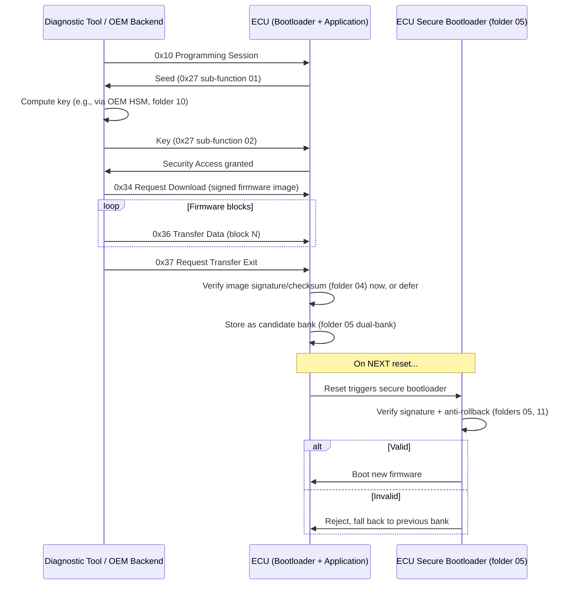

# 16 — Secure Boot Standards by Domain

## Concept

Everything in folders 00-15 is **vendor/domain-agnostic**. In practice,
each industry layers its own **certification standards, evaluation
schemes, and mandatory requirements** on top of these generic secure boot
concepts. This folder maps the generic concepts to the standards you'll
actually be asked to comply with, per domain.

---

## 1. Automotive

| Standard | Scope | Relates to |
|---|---|---|
| **ISO/SAE 21434** | Road vehicles cybersecurity engineering — requires a documented cybersecurity lifecycle, threat analysis & risk assessment (TARA) covering secure boot as a control | 00 (threat model), 14 (attacks) |
| **ISO 26262** | Functional safety (ASIL levels) — secure boot failures must be analyzed for safety impact, not just security | 00, 07 |
| **UNECE R155 / R156** | Regulatory requirement (EU/UN) for cybersecurity management systems (CSMS) and software update management systems (SUMS) — mandates secure, authenticated OTA updates | 11 (anti-rollback), 13 (SSL/TLS for OTA) |
| **AUTOSAR SecOC / CSM** | AUTOSAR's Secure Onboard Communication + Crypto Service Manager modules — how ECUs handle keys/crypto operations in practice | 04, 09 |
| **HSM profiles (EVITA Full/Medium/Light)** | Automotive-specific HSM classification for in-ECU hardware security modules | 09, 10 |
| **ISO 14229 (UDS)** | Unified Diagnostic Services — the protocol used to reprogram ECUs (flash firmware) and gate access via Security Access (seed/key), directly interacting with secure boot | 05, 09, 11 |
| **ISO 15118** | EV charging communication — includes a full PKI (Contract/OEM certificates) for charging authorization, another applied instance of folder 03's CA hierarchy | 03, 13 |

**Practical note:** automotive ECUs are essentially the **MCU secure
boot** model (folder 05) multiplied across dozens of ECUs per vehicle,
each needing its own key hierarchy (folder 03) and secure OTA update
path (folder 13) coordinated at the vehicle/fleet level.

### UDS (ISO 14229) and its relationship to secure boot

**UDS** is the diagnostic/reprogramming protocol (over CAN/CAN-FD,
DoIP) used by tools (dealership tester, OEM backend) to flash new
firmware onto an ECU. It does **not replace** secure boot — it is the
**delivery and access-control mechanism** that gets a new (signed)
image onto the ECU's flash in the first place; secure boot (folder 05)
is what verifies that image is genuine **every time the ECU resets**.

Key UDS services involved in a secure reprogramming session:

| Service ID | Name | Role |
|---|---|---|
| **0x10** | Diagnostic Session Control | Enter Programming Session before flashing |
| **0x27** | Security Access (seed/key) | Challenge-response gate — ECU sends a random "seed", tester must respond with the correct "key" (often HSM-derived) to unlock reprogramming |
| **0x34** | Request Download | Announce the incoming firmware block (address, size, compression/encryption info) |
| **0x36** | Transfer Data | Stream the actual firmware bytes, block by block |
| **0x37** | Request Transfer Exit | Finalize transfer; ECU may verify a checksum/signature here before accepting |
| **0x31** | Routine Control | Trigger vendor-specific routines, e.g., "verify signature now", "erase flash", "check dependencies" |

**Key point:** UDS Security Access (0x27) protects *who can attempt to
reprogram* the ECU over the bus; it is a **transport-level gate**, not a
substitute for the bootloader's own cryptographic signature verification.
A compromised/leaked seed-key algorithm only lets an attacker *attempt* a
flash — secure boot's signature check (folders 04/05) is the actual last
line of defense that decides whether the new image ever executes.

| Standard / Mechanism | Scope | Relates to |
|---|---|---|
| **Android Verified Boot (AVB)** | Google's dm-verity + rollback-index based verified boot for Android devices | 07, 11, 12 |
| **Apple Secure Boot Chain / Secure Enclave** | Apple's documented boot chain (Boot ROM → LLB → iBoot → kernel) + SEP as a hardware secure enclave | 07, 08 |
| **PSA Certified (Arm)** | Platform Security Architecture — tiered certification (Level 1/2/3) for IoT/mobile chips & OSes, covering RoT, attestation, secure boot | 00, 02, 12 |
| **GlobalPlatform TEE / SE specs** | Standardizes Trusted Execution Environment and Secure Element APIs used across mobile chipsets | 08, 09 |
| **FIDO Alliance (device attestation)** | Attestation format used for authenticator/biometric hardware, builds on measured boot concepts | 12 |

## 3. IoT / Embedded

| Standard | Scope | Relates to |
|---|---|---|
| **PSA Certified (Arm)** | Same as above — very common baseline target for Cortex-M IoT MCUs | 05, 06 |
| **NIST IR 8259 / SP 800-193** | US NIST baseline cybersecurity + platform firmware resiliency (detect/protect/recover) guidance for IoT | 00, 14 |
| **ETSI EN 303 645** | EU baseline requirements for consumer IoT security (no default passwords, secure update, etc.) — secure boot supports the "verified software update" provision | 11, 13 |
| **IEC 62443** | Industrial control systems security (includes component-level secure boot expectations for industrial IoT/OT devices) | 00, 09 |
| **Matter / CSA (Connectivity Standards Alliance)** | Smart-home interoperability standard with device attestation requirements (Device Attestation Certificate, DAC) | 03, 12 |

### Open-source RTOS secure boot in IoT (see folder 17 for full detail)
Most certified IoT devices don't write a bootloader from scratch — they
combine an open-source bootloader with an open-source RTOS:

- **MCUboot** (bootloader) + **Zephyr** or **FreeRTOS** (application OS)
  is the most common combination used to reach **PSA Certified Level 1/2**
  — MCUboot verifies the Zephyr/FreeRTOS image's signature and manages
  A/B image slots (folder 05) before jumping to it.
- **Trusted Firmware-M (TF-M)** provides the PSA Root of Trust
  implementation (Secure Processing Environment) that Zephyr/FreeRTOS
  run alongside as the Non-Secure Processing Environment, on
  Armv8-M/TrustZone-M MCUs.

## 4. Payment / Financial

| Standard | Scope | Relates to |
|---|---|---|
| **PCI PTS (PIN Transaction Security)** | Physical + logical security requirements for payment terminals, including secure boot of the terminal firmware | 06, 09 |
| **PCI HSM** | Security requirements specifically for HSMs used in payment key management | 10 |
| **EMVCo Security Requirements** | Chip card / terminal specifications, including key management and secure element requirements | 03, 08, 09 |
| **Common Criteria (CC) EAL4+/EAL5+/EAL6+** | Formal security evaluation scheme often required for payment secure elements/HSMs | 08, 10 |
| **FIPS 140-2/140-3** | US federal crypto module validation (4 security levels), commonly mandated for HSMs used in payment/root key ceremonies — see folder 10 for the full level breakdown | 10 |

## 5. Server / Cloud / Data Center

| Standard | Scope | Relates to |
|---|---|---|
| **UEFI Secure Boot** | PC/server firmware secure boot standard (db/dbx key databases, Secure Boot policy) — the x86 server/PC analogue of folders 01/02 | 01, 02, 03 |
| **TCG TPM 2.0** | Trusted Platform Module spec underlying measured boot + remote attestation in servers/VMs | 12 |
| **DMTF SPDM** | Security Protocol and Data Model — standardizes attestation/measurement exchange between hardware components (e.g., NIC, GPU) and host | 12 |
| **NIST SP 800-193** | Platform firmware resiliency (also applies to servers: detect/protect/recover firmware) | 11, 14 |
| **Confidential Computing (CCC)** | Standards for attesting/isolating VM memory (Intel TDX, AMD SEV-SNP, Arm CCA) — measured boot extended into VM launch | 08, 12 |

---

## How to use this folder

For any project, identify your **domain**, then:
1. Find your mandatory standard(s) in the table above.
2. Cross-reference the folder(s) listed — that's the generic concept the
   standard is layering requirements on top of.
3. Read the standard's actual text for the compliance-specific details
   (audit evidence, certification levels, required test labs) — this
   repo teaches the *underlying mechanism*, not the paperwork.

## Checklist
- [ ] For your target domain, name the primary cybersecurity standard
      and the primary safety standard (if applicable) that apply.
- [ ] Which folder's concept does your domain's OTA/update requirement
      map to (hint: 11 + 13)?
- [ ] Which certification scheme would your HSM/secure element need
      (FIPS 140-3? Common Criteria? PCI HSM?) and why does that depend
      on the domain (payment vs. generic IoT)?
- [ ] In a UDS reprogramming session, which service gates *access* to
      reprogram, and which mechanism actually verifies the *firmware's
      authenticity* before it runs — why are these two different layers?
- [ ] Name the open-source bootloader + RTOS combination commonly used
      to reach PSA Certified Level 1/2 on a Cortex-M IoT device.

## Further Reading
`resources/references.md` → ISO/SAE 21434, ISO 14229 (UDS), UNECE
R155/R156, PSA Certified documentation, NIST SP 800-193 / IR 8259, ETSI
EN 303 645, PCI PTS/HSM standards, EMVCo security guidelines, UEFI
Secure Boot specification, TCG TPM 2.0, DMTF SPDM. See folder 17 for
MCUboot / Zephyr / FreeRTOS / U-Boot implementation details.
