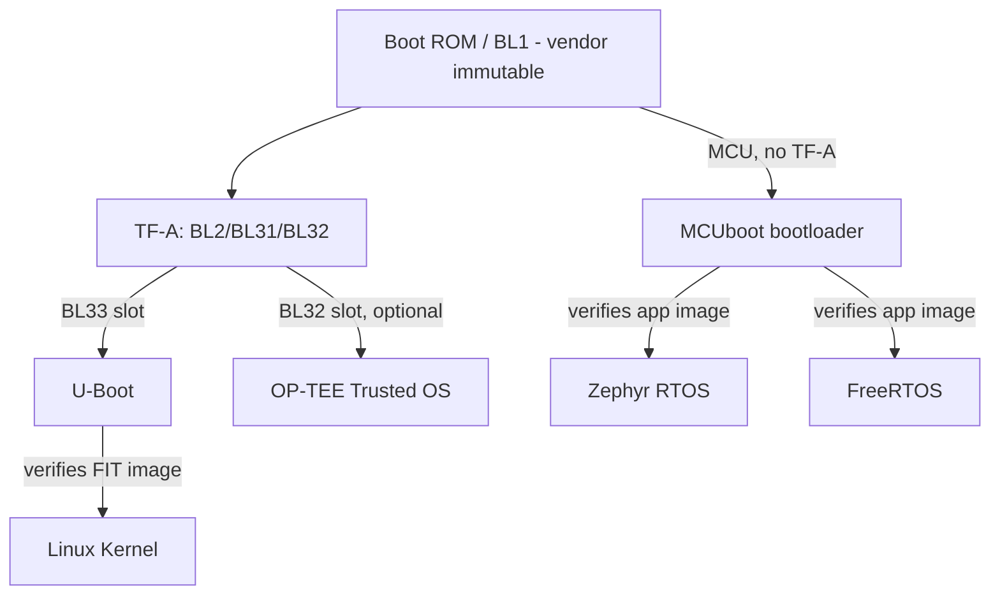
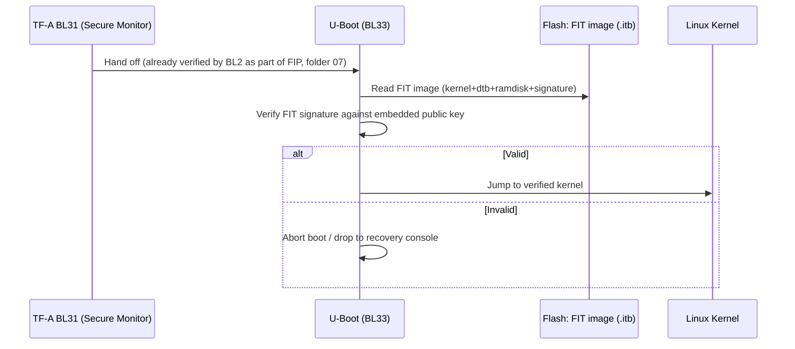
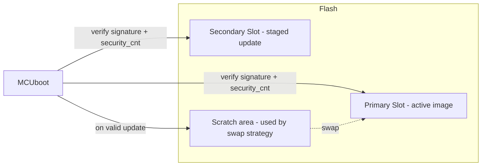
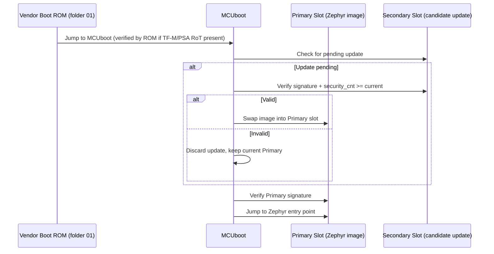
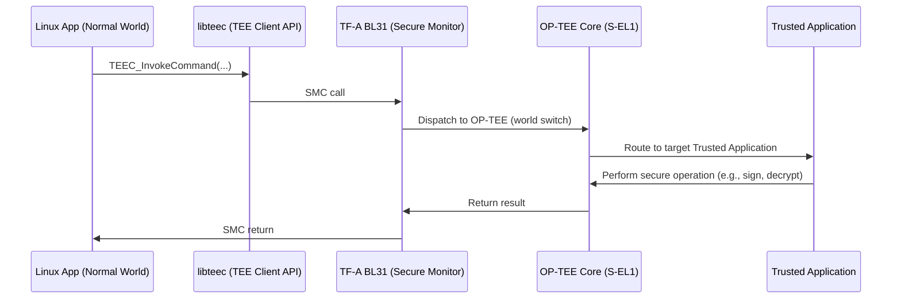

# 17 — Open-Source Bootloaders & RTOS Integration

## Concept

Folders 01-16 describe secure boot *mechanisms* generically (or via TF-A
for Cortex-A). In practice, very few teams write a bootloader from
scratch — most projects assemble a secure boot chain from **existing
open-source components**. This folder maps the concepts you've already
learned onto the specific open-source projects you'll actually touch:
**U-Boot, Zephyr, FreeRTOS (+ MCUboot), and TF-A/OP-TEE**.

### Where each project sits in the boot chain



- **TF-A (folder 07)** is the SoC/Cortex-A reference secure-boot
  firmware. It doesn't include BL33 or the OS — those are supplied by
  another project (usually U-Boot, or an RTOS on a secondary core).
- **U-Boot** is the most common **BL33** occupant: a full Non-Secure
  bootloader that itself verifies and boots Linux.
- **MCUboot** is the Cortex-M equivalent of "BL2" — a small, standalone
  bootloader whose entire job is signature verification + image-slot
  management (folder 05's dual-bank concept), independent of TF-A.
- **Zephyr** and **FreeRTOS** are the RTOS payloads MCUboot verifies and
  boots; they can also run as a secondary/safety-island OS on
  bigger SoCs.

## 1. U-Boot — Non-Secure bootloader (BL33 slot)

U-Boot is normally the **BL33** stage handed off by TF-A's Secure Monitor
(folder 07). Its job: initialize peripherals the OS needs (not already
done by BL2), load the kernel image, **verify it**, then jump.

### U-Boot Verified Boot mechanisms
| Mechanism | What it verifies | Config |
|---|---|---|
| **FIT image signing** | RSA/ECDSA signature over a Flattened Image Tree (kernel + DT + initramfs bundle) | `CONFIG_FIT_SIGNATURE` |
| **`verify-bootloader`** | U-Boot itself can be verified by the prior stage (BL2/SPL) before it runs | `CONFIG_SPL_FIT_SIGNATURE` |
| **U-Boot environment lock** | Prevents runtime tampering with boot arguments (e.g., disabling `console=`, forcing verified paths) | `CONFIG_ENV_IS_NOWHERE` / lock envs |
| **`CONFIG_TFABOOT`** | Boots U-Boot as BL33 under TF-A, inheriting TF-A's verified-boot chain (folder 07) | build-time |

```
FIT image (.itb)
├── kernel@1        (Linux kernel binary)
├── fdt@1           (device tree)
├── ramdisk@1       (initramfs, optional)
└── signature@1     (RSA/ECDSA sig over hashes of the above, verified against
                      a public key compiled into U-Boot's own image — itself
                      already verified by BL2/TF-A)
```

### U-Boot verified boot sequence



## 2. MCUboot — Cortex-M bootloader (Zephyr / FreeRTOS / bare-metal)

**MCUboot** is a standalone, RTOS-agnostic secure bootloader purpose-built
for constrained MCUs. It implements exactly the pattern from folder 05
(dual-bank / A-B image, signature verification, anti-rollback) as a
reusable open-source component instead of custom vendor code.

### MCUboot core concepts
- **Image slots**: `Primary` (active) and `Secondary` (staged update) —
  same idea as folder 05's Bank A/Bank B.
- **Swap strategies**: `swap` (safe, reversible — copies via scratch
  area), `overwrite` (simpler, no rollback to old image), `direct-xip`
  (execute in place from either slot, no copy).
- **Signature algorithms**: RSA-2048/3072 or ECDSA P-256, verified via
  **mbedTLS** or **tinycrypt** — the exact primitives from folder 04.
- **Image trailer**: metadata appended after the image (magic number,
  swap state, image OK flag) that MCUboot uses to track update state
  across resets — critical for power-loss-safe updates.
- **Security counter (`security_cnt`)**: MCUboot's built-in anti-rollback
  mechanism (folder 11), stored in a monotonic counter (TF-M NV counters
  on Cortex-M33, or a dedicated flash region on simpler M0/M3 parts).



### MCUboot + Zephyr integration
Zephyr has **first-class MCUboot support** — a Zephyr application is
built as an MCUboot-compatible image (`west build` produces a signed
`.bin`/`.hex` via `imgtool`), and Zephyr's own DFU/MCUmgr subsystem can
trigger an update that MCUboot verifies on next reset.



### MCUboot + FreeRTOS integration
FreeRTOS doesn't have MCUboot support quite as deeply baked into its
build system as Zephyr, but the pattern is identical: FreeRTOS is built
as a plain application image, signed with `imgtool` (MCUboot's signing
utility), and flashed into MCUboot's Primary/Secondary slots. FreeRTOS's
own **OTA Agent library** (in AWS IoT FreeRTOS distributions) handles
downloading the candidate update into the Secondary slot; MCUboot does
the actual cryptographic verification on the next boot — a clean
separation of "who fetches the update" (FreeRTOS OTA Agent) from "who
verifies and swaps it" (MCUboot), mirroring folder 02's chain-of-trust
principle of never trusting the fetcher's word alone.

## 3. TF-A + OP-TEE — the SoC Secure World stack

Folder 07 covered TF-A's BL1/BL2/BL31 stages; **OP-TEE** is the open-source
project that most commonly fills the **BL32 (Trusted OS)** slot.

- **OP-TEE Core** runs at S-EL1, providing a GlobalPlatform TEE-compliant
  environment for **Trusted Applications (TAs)** — small, isolated secure
  services (e.g., key storage, DRM, biometric matching — folder 08's
  Secure Enclave concepts, but implemented in software-isolated TrustZone
  rather than a separate physical coprocessor).
- OP-TEE TAs are invoked from Normal World via **`SMC` calls routed
  through BL31** (folder 07's runtime SMC sequence) — a Linux
  application calls into `libteec` (TEE Client API), which triggers an
  SMC, which BL31 forwards to OP-TEE.
- OP-TEE's own **Trusted Board Boot**: OP-TEE itself is a signed BL32
  image, verified by BL2 via the same key-cert/content-cert TF-A
  mechanism described in folder 07 — OP-TEE doesn't add a *new* trust
  root, it rides on TF-A's existing chain.



## Summary table — project-to-folder mapping

| Open-source project | Boot chain role | Folder(s) it implements |
|---|---|---|
| **TF-A (Trusted Firmware-A)** | BL1/BL2/BL31 reference firmware for Cortex-A | 07 |
| **U-Boot** | BL33 / Non-Secure bootloader, verifies+boots Linux | 02, 04, 07 |
| **OP-TEE** | BL32 Trusted OS, hosts Trusted Applications | 07, 08 |
| **MCUboot** | Cortex-M bootloader: signature verify + A/B slot swap | 04, 05, 11 |
| **Zephyr** | RTOS payload verified by MCUboot; PSA/TF-M integration | 05, 09 |
| **FreeRTOS** | RTOS payload verified by MCUboot; OTA Agent library | 05, 11, 13 |
| **TF-M (Trusted Firmware-M)** | PSA Root of Trust implementation for Armv8-M/TrustZone-M | 03, 05, 09 |

## Pseudo-code — U-Boot-style FIT verification (simplified)

```c
/* Roughly mirrors U-Boot's image-fit.c verification flow */
int fit_verify_and_boot(const void *fit, const char *conf_name) {
    const void *pubkey = uboot_embedded_pubkey();   /* compiled into U-Boot */

    if (!fit_config_exists(fit, conf_name))
        return -ENOENT;

    /* Each component (kernel, fdt, ramdisk) has its own hash node,
       all covered by one signature over the configuration node */
    if (!fit_config_verify_signature(fit, conf_name, pubkey))
        return -EBADMSG;                              /* tampered/untrusted */

    void *kernel = fit_get_component(fit, conf_name, "kernel");
    void *fdt    = fit_get_component(fit, conf_name, "fdt");

    boot_jump_linux(kernel, fdt);                       /* only after verify */
    return 0; /* unreachable */
}
```

## Checklist
- [ ] Which project typically occupies TF-A's BL33 slot, and what does
      it verify before booting Linux?
- [ ] What problem does MCUboot's "swap" strategy solve that
      "overwrite" does not?
- [ ] Why is FreeRTOS's OTA Agent kept separate from MCUboot's
      verification logic — what security principle does that separation
      reflect (hint: folder 02)?
- [ ] How does OP-TEE reuse TF-A's existing trust chain instead of
      creating its own root of trust?
- [ ] For a new Cortex-M33 IoT project, which two open-source projects
      would you combine to reach PSA Certified Level 1 (hint: folder 16)?

## Further Reading
`resources/references.md` → U-Boot Verified Boot documentation, MCUboot
design documents (`docs/design.md` in the MCUboot repo), Zephyr Project
"DFU and MCUboot" documentation, FreeRTOS OTA documentation, OP-TEE
documentation, Trusted Firmware-M (TF-M) documentation.
