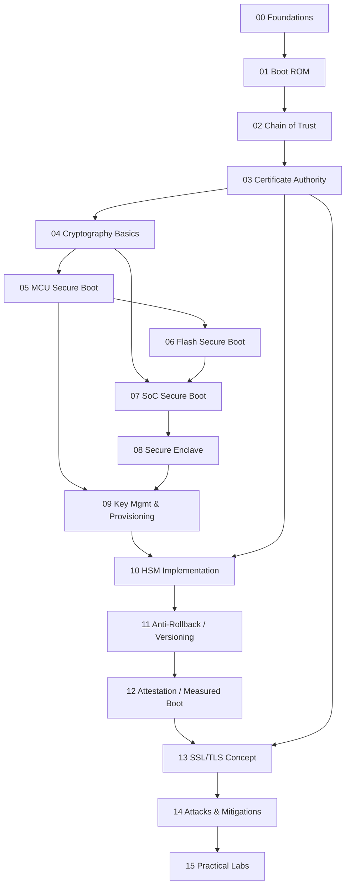
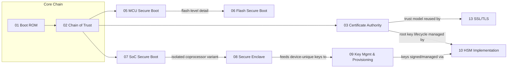

# BootChain — Secure Boot Study Path (MCU → SoC)

A structured, hands-on study repo covering **Secure Boot** concepts from a
simple **MCU** (Arm Cortex-M, e.g. STM32/nRF-class) up to a complex
**SoC/Application Processor** (Arm Cortex-A with TrustZone, ARM Trusted
Firmware, HLOS such as Linux/Android).

## Root Structure

```
BootChain/
├── 00-foundations/                # Why secure boot exists, threat model, terms
├── 01-boot-rom/                    # First instruction executed, immutable code
├── 02-chain-of-trust/              # RoT, signature verification chain concept
├── 03-certificate-authority/       # CA hierarchy: Root/Intermediate/Leaf, revocation
├── 04-cryptography-basics/         # Hash, sign/verify, asymmetric vs symmetric
├── 05-mcu-secure-boot/             # Cortex-M: single-stage / dual-bank secure boot
├── 06-flash-secure-boot/           # XIP auth, flash encryption, RDP levels, TOCTOU
├── 07-soc-secure-boot/             # Cortex-A: BL1→BL2→BL31→BL33, TrustZone, ATF
├── 08-secure-enclave/              # Isolated security coprocessor (SEP/Titan M style)
├── 09-key-management-provisioning/ # OTP/eFuse, key hierarchy, factory provisioning
├── 10-hsm-implementation/          # HSM key ceremony + signing station architecture
├── 11-anti-rollback-versioning/    # Monotonic counters, security version number
├── 12-attestation-measured-boot/   # PCR/measured boot, remote attestation
├── 13-ssl-tls-concept/             # TLS/mTLS, cert chains applied to network trust
├── 14-attacks-mitigations/         # Glitching, downgrade, TOCTOU, known CVEs
├── 15-practical-labs/              # Hands-on: build a toy secure boot verifier
└── resources/                      # Glossary + external references
```

## Recommended Study Sequence

Follow folders **in numeric order** — each builds on the previous one.
Every folder's `README.md` contains its own **visible mermaid diagram(s)**
showing the concept flow, plus pseudo-code and a checklist.



### Concept map — how the new topics relate to the core chain



## How to use each folder

Every folder contains a `README.md` with:
1. **Concept** — plain-language explanation
2. **Diagram** — mermaid sequence/flow diagram
3. **Code / Pseudo-code** — illustrative C-like snippet
4. **Checklist** — what you should be able to answer before moving on
5. **Further Reading** — pointers (see `resources/references.md`)

## Quick Start

```bash
cd 00-foundations && cat README.md
```

Then progress folder by folder. Use `15-practical-labs/` to actually
implement a minimal signature-verification boot stub in C to cement the
concepts.
